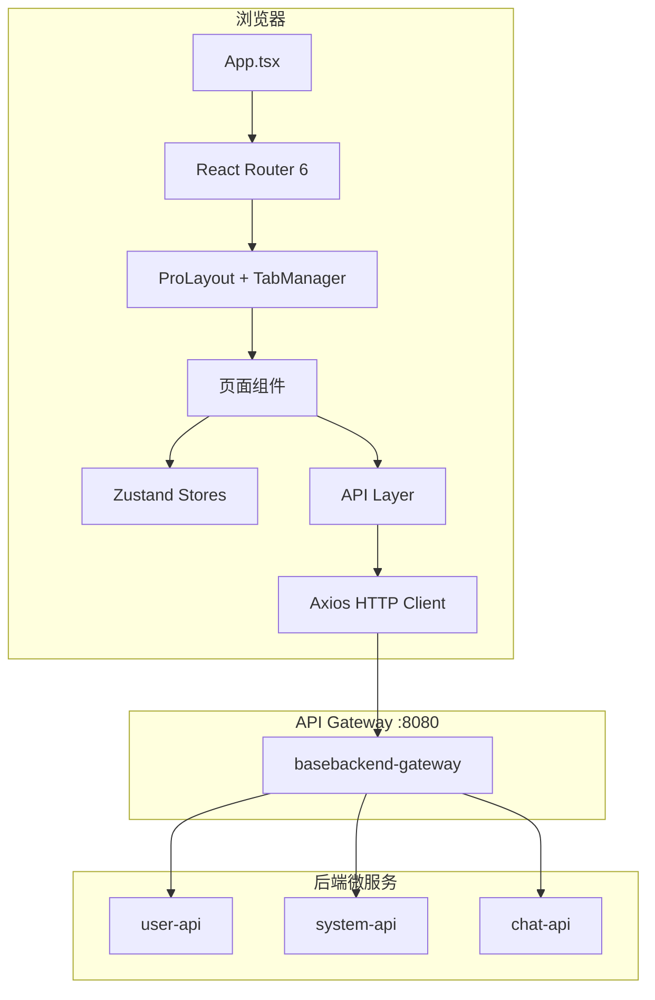
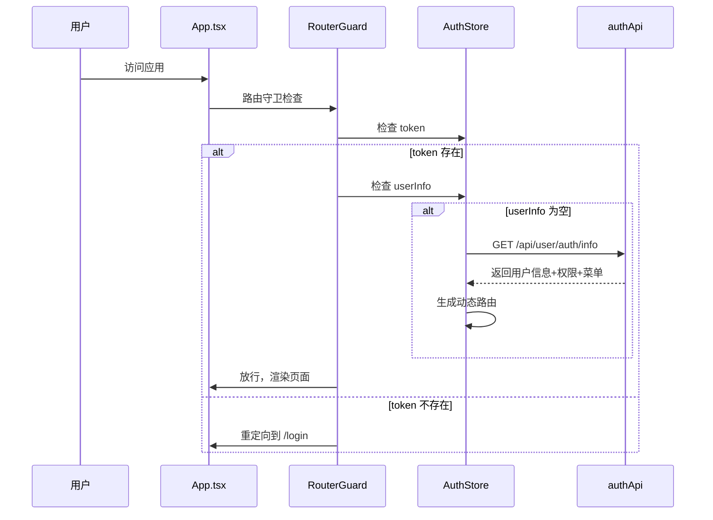

# Design Document: Admin Web Rebuild

## Overview

本设计文档描述 `basebackend-admin-web` 模块的全新重构方案，基于 Ant Design Pro 技术栈构建现代化后台管理系统。系统对接三个后端微服务（`basebackend-user-api`、`basebackend-system-api`、`basebackend-chat-api`），通过 Gateway（`localhost:8080`）统一代理。

### 技术栈

| 类别 | 技术选型 | 版本 |
|------|---------|------|
| 构建工具 | Vite | 6.x |
| UI 框架 | React | 18.x |
| 类型系统 | TypeScript (strict) | 5.x |
| UI 组件库 | Ant Design + Pro Components | 5.x / 2.x |
| 状态管理 | Zustand | 4.x |
| 路由 | React Router | 6.x |
| HTTP 客户端 | Axios | 1.x |
| 图表 | @ant-design/charts | 2.x |
| 代码规范 | ESLint + Prettier | latest |

### 设计目标

1. 完全对接现有后端 API，TypeScript 类型与后端 DTO 一一对应
2. 基于后端返回的菜单/权限数据实现动态路由和按钮级权限控制
3. ProLayout + 多标签页的企业级布局体验
4. Zustand 轻量状态管理，避免过度设计
5. 模块化 API 层，每个后端资源对应独立 API 文件

## Architecture

### 整体架构



### 应用启动流程



### 项目目录结构

```
basebackend-admin-web/
├── index.html
├── vite.config.mts
├── tsconfig.json
├── .env.development          # VITE_API_BASE_URL=/api
├── .env.production           # VITE_API_BASE_URL=https://api.example.com
├── .eslintrc.cjs
├── .prettierrc
├── package.json
└── src/
    ├── main.tsx              # 入口
    ├── App.tsx               # 根组件，路由配置
    ├── api/                  # API 层
    │   ├── request.ts        # Axios 实例 + 拦截器
    │   ├── authApi.ts
    │   ├── userApi.ts
    │   ├── roleApi.ts
    │   ├── menuApi.ts
    │   ├── deptApi.ts
    │   ├── dictApi.ts
    │   ├── logApi.ts
    │   ├── monitorApi.ts
    │   ├── chatApi.ts
    │   └── profileApi.ts
    ├── stores/               # Zustand 状态管理
    │   ├── authStore.ts      # 认证状态（token, user, permissions, menus）
    │   ├── tabStore.ts       # 多标签页状态
    │   └── settingStore.ts   # 应用设置（主题、语言）
    ├── router/
    │   ├── index.tsx         # 路由定义
    │   ├── guard.tsx         # 路由守卫组件
    │   └── dynamicRoutes.ts  # 动态路由生成
    ├── layouts/
    │   ├── BasicLayout.tsx   # ProLayout 主布局
    │   ├── TabBar.tsx        # 多标签页栏
    │   └── UserDropdown.tsx  # 用户下拉菜单
    ├── components/           # 通用组件
    │   ├── Permission.tsx    # 权限包装组件
    │   ├── IconSelector.tsx  # 图标选择器
    │   └── DeptTreeSelect.tsx# 部门树选择器
    ├── hooks/
    │   ├── useAuth.ts        # 权限判断 hook
    │   └── useDict.ts       # 字典数据 hook
    ├── pages/                # 页面
    │   ├── login/
    │   ├── dashboard/
    │   ├── system/
    │   │   ├── user/
    │   │   ├── role/
    │   │   ├── menu/
    │   │   ├── dept/
    │   │   ├── dict/
    │   │   └── config/
    │   ├── monitor/
    │   │   ├── online/
    │   │   ├── operlog/
    │   │   └── loginlog/
    │   ├── chat/
    │   │   ├── stats/
    │   │   ├── message/
    │   │   └── group/
    │   ├── profile/
    │   └── error/
    │       ├── 403.tsx
    │       ├── 404.tsx
    │       └── 500.tsx
    ├── types/                # TypeScript 类型定义
    │   ├── api.d.ts          # 通用 API 响应类型
    │   ├── auth.d.ts
    │   ├── user.d.ts
    │   ├── role.d.ts
    │   ├── menu.d.ts
    │   ├── dept.d.ts
    │   ├── dict.d.ts
    │   ├── log.d.ts
    │   ├── monitor.d.ts
    │   └── chat.d.ts
    ├── styles/
    │   └── global.less       # 全局样式
    └── utils/
        ├── storage.ts        # localStorage 封装
        └── tree.ts           # 树形数据工具函数
```

## Components and Interfaces

### 1. HTTP Client (`api/request.ts`)

Axios 实例封装，负责统一的请求/响应拦截。

```typescript
// 核心接口
interface RequestConfig extends AxiosRequestConfig {
  skipAuth?: boolean; // 跳过 token 附加（如登录接口）
}

// 拦截器链
// 1. 请求拦截：从 authStore 读取 token，附加到 Authorization header
// 2. 响应拦截：
//    - 200: 解包 Result<T>，返回 data 字段
//    - 401: 清除 authStore，跳转 /login
//    - 403: notification.error 提示权限不足
//    - 网络错误/超时: notification.error 提示网络异常
```

### 2. Auth Store (`stores/authStore.ts`)

```typescript
interface AuthState {
  token: string | null;
  userInfo: UserInfo | null;
  permissions: Set<string>;
  roles: Set<string>;
  menus: MenuDTO[];          // 后端返回的原始菜单数据
  dynamicRoutes: RouteObject[]; // 生成的动态路由

  // Actions
  login: (username: string, password: string) => Promise<void>;
  logout: () => Promise<void>;
  fetchUserInfo: () => Promise<void>;
  hasPermission: (perm: string) => boolean;
  reset: () => void;
}
```

Token 持久化策略：`zustand/middleware` 的 `persist` 中间件，存储到 `localStorage`。

### 3. Tab Store (`stores/tabStore.ts`)

```typescript
interface TabItem {
  key: string;       // 路由 path
  title: string;     // 标签标题
  closable: boolean; // 首页不可关闭
}

interface TabState {
  tabs: TabItem[];
  activeKey: string;
  addTab: (tab: TabItem) => void;
  removeTab: (key: string) => void;
  setActiveTab: (key: string) => void;
}
```

### 4. Setting Store (`stores/settingStore.ts`)

```typescript
interface SettingState {
  theme: 'light' | 'dark';
  primaryColor: string;       // 默认 #1677ff
  collapsed: boolean;         // 侧边栏折叠
  toggleTheme: () => void;
  toggleCollapsed: () => void;
}
```

持久化到 `localStorage`，页面刷新后恢复用户偏好。

### 5. BasicLayout (`layouts/BasicLayout.tsx`)

基于 ProLayout 的主布局组件：

- 深色侧边栏 (`navTheme: 'realDark'`)
- 从 `authStore.menus` 动态生成菜单
- 顶部右侧：全屏按钮、主题切换、用户头像下拉
- 内容区上方：面包屑 + TabBar

### 6. RouterGuard (`router/guard.tsx`)

路由守卫组件，包裹在需要认证的路由外层：

```typescript
// 逻辑：
// 1. 白名单路由（/login, /403, /404, /500）直接放行
// 2. 无 token → 重定向 /login
// 3. 有 token 但无 userInfo → 调用 fetchUserInfo
// 4. 有 token + userInfo → 检查当前路由是否在用户菜单中
//    - 在 → 放行
//    - 不在 → 重定向 /403
```

### 7. useAuth Hook (`hooks/useAuth.ts`)

```typescript
function useAuth(permission: string): boolean;
function useAuth(permissions: string[], mode?: 'any' | 'all'): boolean;
```

从 `authStore` 读取权限集合，判断当前用户是否拥有指定权限。用于页面中按钮级别的条件渲染。

### 8. Permission Component (`components/Permission.tsx`)

```typescript
interface PermissionProps {
  code: string;
  children: React.ReactNode;
  fallback?: React.ReactNode;
}
```

声明式权限控制组件，内部调用 `useAuth`，无权限时渲染 `fallback` 或 `null`。

### 9. Dynamic Route Generation (`router/dynamicRoutes.ts`)

```typescript
// 将后端菜单数据转换为 React Router 6 的 RouteObject[]
function generateRoutes(menus: MenuDTO[]): RouteObject[];

// 菜单类型映射：
// type=0 (目录) → 路由分组，不对应页面
// type=1 (菜单) → 懒加载页面组件
// type=2 (按钮) → 不生成路由，仅用于权限判断
```

页面组件通过 `React.lazy()` + `import()` 实现按需加载。

### 10. API Module Pattern

每个 API 模块遵循统一模式：

```typescript
// 以 userApi.ts 为例
import request from './request';
import type { UserDTO, UserCreateDTO, UserQueryDTO, PageResult } from '@/types';

export const userApi = {
  page: (params: UserQueryDTO & { current: number; size: number }) =>
    request.get<PageResult<UserDTO>>('/api/user/users', { params }),

  getById: (id: number) =>
    request.get<UserDTO>(`/api/user/users/${id}`),

  create: (data: UserCreateDTO) =>
    request.post<void>('/api/user/users', data),

  update: (id: number, data: Partial<UserDTO>) =>
    request.put<void>(`/api/user/users/${id}`, data),

  delete: (id: number) =>
    request.delete<void>(`/api/user/users/${id}`),

  resetPassword: (id: number, newPassword: string) =>
    request.put<void>(`/api/user/users/${id}/reset-password`, null, { params: { newPassword } }),

  assignRoles: (id: number, roleIds: number[]) =>
    request.put<void>(`/api/user/users/${id}/roles`, roleIds),

  changeStatus: (id: number, status: number) =>
    request.put<void>(`/api/user/users/${id}/status`, null, { params: { status } }),
};
```


## Data Models

TypeScript 类型定义与后端 Java DTO 一一对应。以下为核心类型定义。

### 通用 API 响应 (`types/api.d.ts`)

```typescript
// 对应后端 com.basebackend.common.model.Result<T>
interface Result<T = unknown> {
  code: number;
  message: string;
  data: T;
  success: boolean;
}

// 对应后端 MyBatis-Plus Page<T>
interface PageResult<T> {
  records: T[];
  total: number;
  size: number;
  current: number;
  pages: number;
}

// 对应后端 com.basebackend.common.dto.PageResult<T>
interface SimplePageResult<T> {
  list: T[];
  total: number;
}
```

### 认证相关 (`types/auth.d.ts`)

```typescript
// 对应 LoginRequest
interface LoginParams {
  username: string;
  password: string;
  captcha?: string;
  captchaId?: string;
  rememberMe?: boolean;
}

// 对应 LoginResponse
interface LoginResult {
  accessToken: string;
  tokenType: string;
  expiresIn: number;
  userInfo: UserInfo;
  permissions: string[];
  roles: string[];
}

// 对应 LoginResponse.UserInfo
interface UserInfo {
  userId: number;
  username: string;
  nickname: string;
  email: string;
  phone: string;
  avatar: string;
  gender: number;
  deptId: number;
  deptName: string;
  userType: number;
  status: number;
}

// 对应 UserContext（GET /api/user/auth/info 返回）
interface UserContext {
  userId: number;
  username: string;
  nickname: string;
  email: string;
  phone: string;
  avatar: string;
  gender: number;
  deptId: number;
  deptName: string;
  userType: number;
  status: number;
  roleIds: number[];
  roles: string[];
  permissions: string[];
}
```

### 用户管理 (`types/user.d.ts`)

```typescript
// 对应 UserDTO
interface UserDTO {
  id: number;
  username: string;
  nickname: string;
  email: string;
  phone: string;
  avatar: string;
  gender: number;
  birthday: string;
  deptId: number;
  deptName: string;
  userType: number;
  status: number;
  roleIds: number[];
  roleNames: string[];
  remark: string;
}

// 对应 UserCreateDTO
interface UserCreateDTO {
  username: string;
  password: string;
  nickname: string;
  email?: string;
  phone?: string;
  avatar?: string;
  gender?: number;
  birthday?: string;
  deptId?: number;
  userType?: number;
  status?: number;
  roleIds?: number[];
  remark?: string;
}

// 对应 UserQueryDTO
interface UserQueryDTO {
  username?: string;
  nickname?: string;
  phone?: string;
  status?: number;
  deptId?: number;
}
```

### 角色管理 (`types/role.d.ts`)

```typescript
// 对应 RoleDTO
interface RoleDTO {
  id: number;
  appId: number;
  roleName: string;
  roleKey: string;
  roleSort: number;
  dataScope: number;
  status: number;
  remark: string;
  menuIds: number[];
  permissionIds: number[];
}
```

### 权限/菜单 (`types/menu.d.ts`)

```typescript
// 对应 PermissionDTO
interface PermissionDTO {
  id: number;
  permissionName: string;
  permissionKey: string;
  apiPath: string;
  httpMethod: string;
  permissionType: number; // 1-菜单权限, 2-按钮权限, 3-API权限
  status: number;
  remark: string;
}

// 前端菜单树节点（由后端权限数据 + 前端路由配置组合）
interface MenuItem {
  id: number;
  parentId: number;
  name: string;
  icon: string;
  path: string;
  permissionKey: string;
  type: number;       // 0-目录, 1-菜单, 2-按钮
  orderNum: number;
  status: number;
  children?: MenuItem[];
}
```

### 部门管理 (`types/dept.d.ts`)

```typescript
// 对应 DeptDTO
interface DeptDTO {
  id: number;
  deptName: string;
  parentId: number;
  orderNum: number;
  leader: string;
  phone: string;
  email: string;
  status: number;
  remark: string;
  children?: DeptDTO[];
}
```

### 字典管理 (`types/dict.d.ts`)

```typescript
// 对应 DictDTO
interface DictTypeDTO {
  id: number;
  appId: number;
  dictName: string;
  dictType: string;
  status: number;
  remark: string;
}

// 对应 DictDataDTO
interface DictDataDTO {
  id: number;
  appId: number;
  dictSort: number;
  dictLabel: string;
  dictValue: string;
  dictType: string;
  cssClass: string;
  listClass: string;
  isDefault: number;
  status: number;
  remark: string;
}
```

### 日志 (`types/log.d.ts`)

```typescript
// 对应 OperationLogDTO
interface OperationLogDTO {
  id: string;
  userId: number;
  username: string;
  operation: string;
  method: string;
  params: string;
  time: number;
  ipAddress: string;
  location: string;
  status: number;
  errorMsg: string;
  operationTime: string;
}

// 对应 LoginLogDTO
interface LoginLogDTO {
  id: string;
  userId: number;
  username: string;
  ipAddress: string;
  loginLocation: string;
  browser: string;
  os: string;
  status: number;
  msg: string;
  loginTime: string;
}
```

### 监控 (`types/monitor.d.ts`)

```typescript
// 对应 OnlineUserDTO
interface OnlineUserDTO {
  userId: number;
  username: string;
  nickname: string;
  deptName: string;
  loginIp: string;
  loginLocation: string;
  browser: string;
  os: string;
  loginTime: string;
  lastAccessTime: string;
  token: string;
}

// 对应 ServerInfoDTO
interface ServerInfoDTO {
  serverName: string;
  serverIp: string;
  osName: string;
  osVersion: string;
  osArch: string;
  javaVersion: string;
  javaVendor: string;
  jvmName: string;
  jvmVersion: string;
  jvmVendor: string;
  totalMemory: string;
  usedMemory: string;
  freeMemory: string;
  memoryUsage: string;
  processorCount: number;
  systemLoad: string;
  uptime: string;
}

// 对应 CacheInfoDTO
interface CacheInfoDTO {
  cacheName: string;
  cacheSize: number;
  hitCount: number;
  missCount: number;
  hitRate: string;
}
```

### 聊天管理 (`types/chat.d.ts`)

```typescript
// 对应 ChatMessage 实体
interface ChatMessage {
  id: number;
  conversationId: number;
  senderId: number;
  senderName?: string;
  messageType: string;  // TEXT, IMAGE, FILE, etc.
  content: string;
  status: number;
  sendTime: string;
}

// 对应 GroupVO
interface ChatGroup {
  id: number;
  groupName: string;
  ownerId: number;
  ownerName?: string;
  memberCount: number;
  maxMembers: number;
  status: number;
  createTime: string;
}

// 对应 GroupMemberVO
interface ChatGroupMember {
  userId: number;
  username: string;
  nickname: string;
  avatar: string;
  role: number;       // GroupRole enum
  joinTime: string;
}
```

### 个人中心 (`types/auth.d.ts` 扩展)

```typescript
// 对应 ProfileDetailDTO
interface ProfileDetail {
  userId: number;
  username: string;
  nickname: string;
  email: string;
  phone: string;
  avatar: string;
  gender: number;
  birthday: string;
  deptId: number;
  deptName: string;
  userType: number;
  status: number;
  loginIp: string;
  loginTime: string;
  createTime: string;
}

// 对应 UpdateProfileDTO
interface UpdateProfileParams {
  nickname?: string;
  email?: string;
  phone?: string;
  avatar?: string;
  gender?: number;
  birthday?: string;
}

// 对应 ChangePasswordDTO
interface ChangePasswordParams {
  oldPassword: string;
  newPassword: string;
  confirmPassword: string;
}
```


## Correctness Properties

*A property is a characteristic or behavior that should hold true across all valid executions of a system — essentially, a formal statement about what the system should do. Properties serve as the bridge between human-readable specifications and machine-verifiable correctness guarantees.*

### Property 1: Token attached to every request

*For any* outgoing HTTP request made through the Axios instance when a non-null token exists in AuthStore, the request's `Authorization` header should equal `"Bearer <token>"`.

**Validates: Requirements 2.1**

### Property 2: HTTP error handling by status code

*For any* HTTP response received by the Axios interceptor:
- If the status is 401, the AuthStore should be cleared (token = null, userInfo = null) and navigation should redirect to `/login`.
- If the status is 403, a notification with a "权限不足" message should be triggered.
- If the error is a network error or timeout, a notification with a descriptive error message should be triggered.

**Validates: Requirements 2.2, 2.3, 2.4**

### Property 3: Login error message propagation

*For any* login attempt that results in an error response from the server, the error message from `Result.message` should be displayed on the login form, and the AuthStore should remain unchanged (no token stored).

**Validates: Requirements 3.5**

### Property 4: Token persistence round-trip

*For any* valid token string, storing it in AuthStore and then creating a new AuthStore instance (simulating page refresh by reading from localStorage) should yield the same token value.

**Validates: Requirements 3.7**

### Property 5: Sidebar menu generation from AuthStore menus

*For any* array of MenuItem objects stored in AuthStore (with types directory=0, menu=1, button=2), the generated sidebar menu should contain exactly the items of type 0 and 1 (excluding type 2 buttons), preserving the tree hierarchy and sort order.

**Validates: Requirements 4.4**

### Property 6: Tab bar reflects navigation history

*For any* sequence of route navigations, the TabStore should contain one tab per unique visited route, the active tab should match the current route, and closing a tab should remove it from the list and activate the nearest remaining tab.

**Validates: Requirements 4.5**

### Property 7: Dynamic route generation from menu data

*For any* array of MenuItem objects, `generateRoutes()` should produce a RouteObject array where:
- Each MenuItem of type=1 (menu) with a non-empty path maps to exactly one route with a lazy-loaded component.
- Each MenuItem of type=0 (directory) maps to a route group containing its children.
- MenuItems of type=2 (button) produce no routes.
- The total number of leaf routes equals the count of type=1 items.

**Validates: Requirements 5.1**

### Property 8: Unauthenticated access redirects to login

*For any* protected route path (not in the whitelist [/login, /403, /404, /500]), when AuthStore has no token, the RouterGuard should redirect to `/login`.

**Validates: Requirements 5.2**

### Property 9: Unauthorized route access shows 403

*For any* route path not present in the authenticated user's menu list, when the user has a valid token and userInfo, the RouterGuard should redirect to `/403`.

**Validates: Requirements 5.3**

### Property 10: useAuth permission check correctness

*For any* permission string `p` and any set of user permissions `S` in AuthStore, `useAuth(p)` should return `true` if and only if `p ∈ S` or `S` contains a wildcard (`*:*:*` or `*`).

**Validates: Requirements 5.4**

### Property 11: Password confirmation validation

*For any* pair of strings (newPassword, confirmPassword), the password change form should only allow submission when `newPassword === confirmPassword` and both are non-empty. When they differ, a validation error should be displayed and the form should not submit.

**Validates: Requirements 19.4**

### Property 12: Responsive sidebar collapse

*For any* viewport width less than 768px, the sidebar should be in collapsed (icon-only) mode. For any viewport width >= 768px, the sidebar should respect the user's manual collapse preference.

**Validates: Requirements 20.4**

### Property 13: Theme preference persistence round-trip

*For any* theme value ('light' or 'dark'), setting it in SettingStore and then creating a new SettingStore instance (simulating page refresh by reading from localStorage) should yield the same theme value.

**Validates: Requirements 20.5**

## Error Handling

### HTTP 层错误处理

| 错误类型 | 处理方式 | 用户反馈 |
|---------|---------|---------|
| 401 Unauthorized | 清除 AuthStore，跳转 `/login` | 自动跳转，无额外提示 |
| 403 Forbidden | 不清除状态 | `notification.error` 提示"权限不足" |
| 404 Not Found | 不清除状态 | `notification.error` 提示"资源不存在" |
| 500 Server Error | 不清除状态 | `notification.error` 提示"服务器错误" |
| Network Error | 不清除状态 | `notification.error` 提示"网络连接失败" |
| Timeout | 不清除状态 | `notification.error` 提示"请求超时" |

### 业务层错误处理

后端统一返回 `Result<T>` 结构，其中 `code !== 200` 表示业务错误：

```typescript
// 响应拦截器中
if (response.data.code !== 200) {
  // 业务错误，使用 message.error 显示后端返回的 message
  message.error(response.data.message || '操作失败');
  return Promise.reject(new Error(response.data.message));
}
return response.data.data; // 直接返回 data 字段
```

### 表单验证错误

- 使用 Ant Design Form 的内置验证机制
- 必填字段：红色星号标记 + 提交时高亮
- 格式验证：邮箱、手机号、密码强度等使用正则
- 异步验证：用户名唯一性、部门名称唯一性等调用后端 check 接口
- 密码确认：前端实时校验两次输入是否一致

### 路由错误处理

- 未匹配路由 → 404 页面
- 无权限路由 → 403 页面
- 应用级错误 → 500 页面 + ErrorBoundary 捕获

## Testing Strategy

### 测试框架

| 工具 | 用途 |
|------|------|
| Vitest | 单元测试运行器 |
| React Testing Library | 组件渲染测试 |
| fast-check | 属性基测试（Property-Based Testing） |
| MSW (Mock Service Worker) | API Mock |

### 单元测试

单元测试覆盖以下关键模块：

1. **HTTP Client 拦截器**：验证 token 附加、各状态码处理、网络错误处理
2. **AuthStore**：验证 login/logout 流程、token 持久化、权限判断
3. **TabStore**：验证标签页增删切换逻辑
4. **SettingStore**：验证主题切换和持久化
5. **useAuth Hook**：验证权限判断逻辑
6. **dynamicRoutes**：验证菜单到路由的转换
7. **RouterGuard**：验证认证和授权守卫逻辑
8. **树形工具函数**：验证 `listToTree`、`flattenTree` 等工具函数
9. **表单验证**：验证密码确认匹配等自定义验证规则

### 属性基测试（Property-Based Testing）

使用 `fast-check` 库实现属性基测试，每个属性测试至少运行 100 次迭代。

每个测试必须以注释标注对应的设计属性：

```typescript
// Feature: admin-web-rebuild, Property 1: Token attached to every request
```

属性测试覆盖以下 13 个属性：

| 属性编号 | 属性名称 | 测试策略 |
|---------|---------|---------|
| Property 1 | Token attached to every request | 生成随机 token 字符串，验证请求头包含 Bearer token |
| Property 2 | HTTP error handling by status code | 生成随机 HTTP 状态码（401/403/网络错误），验证对应处理行为 |
| Property 3 | Login error message propagation | 生成随机错误消息字符串，验证登录失败时消息正确显示 |
| Property 4 | Token persistence round-trip | 生成随机 token 字符串，验证存储→读取的往返一致性 |
| Property 5 | Sidebar menu from AuthStore | 生成随机菜单树（含 type 0/1/2），验证侧边栏只包含 type 0/1 |
| Property 6 | Tab bar reflects navigation | 生成随机路由路径序列，验证 TabStore 状态正确 |
| Property 7 | Dynamic route generation | 生成随机菜单树，验证路由数量等于 type=1 菜单数量 |
| Property 8 | Unauthenticated redirect | 生成随机受保护路由路径，验证无 token 时重定向到 /login |
| Property 9 | Unauthorized route shows 403 | 生成随机路由路径（不在菜单中），验证重定向到 /403 |
| Property 10 | useAuth permission check | 生成随机权限字符串和权限集合，验证 useAuth 返回值正确 |
| Property 11 | Password confirmation validation | 生成随机密码对，验证匹配/不匹配时的表单行为 |
| Property 12 | Responsive sidebar collapse | 生成随机视口宽度（100-2000px），验证 768px 阈值行为 |
| Property 13 | Theme persistence round-trip | 生成随机主题值，验证存储→读取的往返一致性 |

### 测试组织

```
basebackend-admin-web/
└── src/
    └── __tests__/
        ├── unit/
        │   ├── request.test.ts       # HTTP Client 单元测试
        │   ├── authStore.test.ts     # AuthStore 单元测试
        │   ├── tabStore.test.ts      # TabStore 单元测试
        │   ├── settingStore.test.ts  # SettingStore 单元测试
        │   ├── useAuth.test.ts       # useAuth Hook 单元测试
        │   ├── dynamicRoutes.test.ts # 动态路由生成单元测试
        │   └── tree.test.ts          # 树形工具函数单元测试
        └── property/
            ├── request.property.test.ts    # Property 1, 2
            ├── auth.property.test.ts       # Property 3, 4
            ├── menu.property.test.ts       # Property 5, 7
            ├── tab.property.test.ts        # Property 6
            ├── guard.property.test.ts      # Property 8, 9
            ├── permission.property.test.ts # Property 10
            ├── form.property.test.ts       # Property 11
            └── ui.property.test.ts         # Property 12, 13
```

### 测试配置

```typescript
// vitest.config.ts
export default defineConfig({
  test: {
    environment: 'jsdom',
    globals: true,
    setupFiles: ['./src/__tests__/setup.ts'],
  },
});
```

属性测试配置：每个 `fc.assert` 调用使用 `{ numRuns: 100 }` 确保至少 100 次迭代。

