# BaseBackend

## 项目愿景

基于 Java 17 / Spring Boot 3.1.5 / Spring Cloud 2022.0.4 的企业级微服务后台管理系统。采用 RBAC 权限模型，集成工作流引擎、消息队列、分布式事务、可观测性、文件存储等企业核心能力。前端基于 React 18 + TypeScript + Ant Design 5。

## 架构总览

| 维度 | 技术选型 |
|------|---------|
| 语言 | Java 17, TypeScript 5 |
| 后端框架 | Spring Boot 3.1.5, Spring Cloud 2022.0.4 |
| 前端框架 | React 18, Vite, Ant Design 5, Zustand |
| ORM | MyBatis Plus 3.5.5 |
| 数据库 | MySQL 8 (Druid连接池), Flyway迁移 |
| 缓存 | Redis / Redisson 3.24.3 |
| 消息队列 | RocketMQ 5.2.0 |
| 注册/配置中心 | Nacos 3.1.0 |
| 分布式事务 | Seata 1.7.1 (AT模式) |
| 工作流 | Camunda BPM 7.21.0 |
| API网关 | Spring Cloud Gateway |
| 文件存储 | MinIO 8.5.7 |
| 可观测性 | OpenTelemetry + Micrometer + Loki + Prometheus + Tempo |
| 安全 | JWT (jjwt 0.12.3), Spring Security, OWASP HTML Sanitizer |
| Feature Toggle | Unleash / Flagsmith |
| API文档 | Knife4j 4.3.0 / SpringDoc OpenAPI 2.2.0 |
| 构建 | Maven, JaCoCo, Checkstyle, SpotBugs, SonarCloud |
| CI/CD | GitHub Actions, Docker |

## 模块结构图

```mermaid
graph TD
    ROOT["basebackend-parent"] --> COMMON["basebackend-common"]
    COMMON --> COMMON_CORE["common-core"]
    COMMON --> COMMON_DTO["common-dto"]
    COMMON --> COMMON_UTIL["common-util"]
    COMMON --> COMMON_CTX["common-context"]
    COMMON --> COMMON_SEC["common-security"]
    COMMON --> COMMON_STARTER["common-starter"]
    COMMON --> COMMON_STORAGE["common-storage"]

    ROOT --> INFRA_LIB["基础设施库"]
    INFRA_LIB --> JWT["basebackend-jwt"]
    INFRA_LIB --> DB["basebackend-database"]
    INFRA_LIB --> CACHE["basebackend-cache"]
    INFRA_LIB --> LOG["basebackend-logging"]
    INFRA_LIB --> SEC["basebackend-security"]
    INFRA_LIB --> SEC_START["basebackend-security-starter"]
    INFRA_LIB --> OBS["basebackend-observability"]
    INFRA_LIB --> MSG["basebackend-messaging"]
    INFRA_LIB --> NACOS["basebackend-nacos"]
    INFRA_LIB --> TX["basebackend-transaction"]
    INFRA_LIB --> FT["basebackend-feature-toggle"]
    INFRA_LIB --> WEB["basebackend-web"]
    INFRA_LIB --> FEIGN["basebackend-feign-api"]

    ROOT --> SERVICES["可部署微服务"]
    SERVICES --> GW["basebackend-gateway"]
    SERVICES --> USER_API["basebackend-user-api"]
    SERVICES --> SYS_API["basebackend-system-api"]
    SERVICES --> NOTIF["basebackend-notification-service"]
    SERVICES --> OBS_SVC["basebackend-observability-service"]
    SERVICES --> FILE_SVC["basebackend-file-service"]

    ROOT --> SCHED["basebackend-scheduler-parent"]
    SCHED --> SCHED_CORE["scheduler-core"]
    SCHED --> SCHED_WF["scheduler-workflow"]
    SCHED --> SCHED_PROC["scheduler-processor"]
    SCHED --> SCHED_MET["scheduler-metrics"]
    SCHED --> SCHED_INT["scheduler-integration"]

    ROOT --> TOOLS["工具模块"]
    TOOLS --> CODEGEN["basebackend-code-generator"]
    TOOLS --> BACKUP["basebackend-backup"]

    ROOT --> FRONTEND["basebackend-admin-web"]

    click COMMON "./basebackend-common/CLAUDE.md" "common模块文档"
    click FRONTEND "./basebackend-admin-web/CLAUDE.md" "前端模块文档"
    click GW "./basebackend-gateway/CLAUDE.md" "网关模块文档"
    click CACHE "./basebackend-cache/CLAUDE.md" "缓存模块文档"
    click DB "./basebackend-database/CLAUDE.md" "数据库模块文档"
    click BACKUP "./basebackend-backup/CLAUDE.md" "备份模块文档"
    click MSG "./basebackend-messaging/CLAUDE.md" "消息模块文档"
    click SCHED "./basebackend-scheduler-parent/CLAUDE.md" "调度模块文档"
```



## 模块索引

| 模块路径 | 类型 | 语言 | 职责 |
|---------|------|------|------|
| `basebackend-common/` | 聚合库 | Java | 公共基础能力(core/dto/util/context/security/starter/storage) |
| `basebackend-jwt/` | 库 | Java | JWT令牌生成、验证、刷新 |
| `basebackend-database/` | 库 | Java | 动态数据源、分库分表(ShardingSphere)、审计日志、健康监控 |
| `basebackend-cache/` | 库 | Java | 多级缓存、分布式锁、缓存预热、注解驱动缓存 |
| `basebackend-logging/` | 库 | Java | 结构化日志、审计日志、日志脱敏 |
| `basebackend-security/` | 库 | Java | 安全核心：XSS防护、密钥管理、输入校验 |
| `basebackend-security-starter/` | Starter | Java | 安全自动配置 |
| `basebackend-observability/` | 库 | Java | Metrics/Tracing/Logging/SLO/告警 |
| `basebackend-messaging/` | 库 | Java | RocketMQ集成、事务消息、幂等、死信、Webhook |
| `basebackend-nacos/` | 库 | Java | Nacos配置管理、服务发现、灰度发布 |
| `basebackend-transaction/` | 库 | Java | Seata分布式事务封装 |
| `basebackend-feature-toggle/` | 库 | Java | Feature Toggle / A/B测试(Unleash/Flagsmith) |
| `basebackend-web/` | 库 | Java | Web层公共配置 |
| `basebackend-feign-api/` | 库 | Java | Feign客户端接口定义 |
| `basebackend-gateway/` | 服务 | Java | Spring Cloud Gateway统一入口 |
| `basebackend-user-api/` | 服务 | Java | 用户微服务，承接用户域与认证能力 |
| `basebackend-system-api/` | 服务 | Java | 系统管理微服务，承接部门/字典/权限/监控等系统域能力 |
| `basebackend-notification-service/` | 服务 | Java | 通知微服务 |
| `basebackend-observability-service/` | 服务 | Java | 可观测性微服务 |
| `basebackend-file-service/` | 服务 | Java | 文件存储微服务(MinIO) |
| `basebackend-scheduler-parent/` | 聚合服务 | Java | 任务调度与工作流(PowerJob + Camunda) |
| `basebackend-backup/` | 库 | Java | 数据库备份(MySQL/PostgreSQL)、增量备份、S3存储 |
| `basebackend-code-generator/` | 工具 | Java | 代码生成器(FreeMarker/Velocity) |
| `basebackend-admin-web/` | 前端 | TypeScript | React 18管理后台前端 |

## 运行与开发

```bash
# 后端构建
mvn clean install -DskipTests

# 单模块启动 (user-api, 端口8081)
cd basebackend-user-api && mvn spring-boot:run -Dspring-boot.run.profiles=dev

# 前端启动
cd basebackend-admin-web && npm install && npm run dev

# Docker 基础设施
cd docker/compose && docker-compose up -d          # MySQL/Redis/MinIO
cd docker/nacos && docker-compose up -d             # Nacos集群
cd docker/messaging && docker-compose up -d         # RocketMQ
cd docker/seata-server && docker-compose up -d      # Seata Server
cd docker/observability && docker-compose up -d     # Loki/Prometheus/Tempo
```

**环境要求**: Java 17+, Maven 3.8+, Node.js 18+, MySQL 8, Redis 6+

**配置文件层级**: `application.yml` -> `application-{profile}.yml` -> `bootstrap.yml`(Nacos)

**数据库迁移**: Flyway, 脚本在 `src/main/resources/db/migration/`, 命名规范 `V{major}.{minor}__description.sql`

## 测试策略

- 单元测试: JUnit 5 + Mockito, 覆盖 service/controller/delegate/util 层
- 集成测试: `maven-failsafe-plugin`, 通过 `-Pintegration` profile 激活
- 覆盖率: JaCoCo, LINE >= 30%, BRANCH >= 20%
- 代码质量: Checkstyle + SpotBugs + SonarCloud + OWASP Dependency Check (CVSS >= 7.0 阻断)
- 前端: 暂无自动化测试

**已有测试的模块**: cache(11), database(5), common-security(3), feature-toggle(3), scheduler-old(20+), backup(4), nacos(4), file-service(4), observability(6), system-api(12+), messaging(5), user-api(1), logging(1)

## 编码规范

- Java 17 语法, Lombok 注解驱动
- 分层架构: Controller -> Service(Interface+Impl) -> Mapper -> Entity
- MyBatis Plus: ASSIGN_ID主键策略, 逻辑删除(deleted字段)
- 驼峰映射: 数据库下划线 -> Java驼峰 自动转换
- API: RESTful, Knife4j注解文档化
- 前端: TypeScript严格模式, 目录按功能分组(api/pages/stores/components/hooks/utils)

## AI 使用指引

- 后端修改需同时检查对应的 Mapper XML、Flyway迁移、DTO映射
- 后台服务当前以 `user-api` + `system-api` 微服务拆分形态为主
- `basebackend-scheduler-old` 和 `basebackend-scheduler-backup` 是遗留代码，新调度逻辑在 `basebackend-scheduler-parent/`
- 前端路由集中在 `basebackend-admin-web/src/router/index.tsx`
- 状态管理用 Zustand (stores/), 全局上下文用 React Context (contexts/)
- 国际化: i18next, 语言包在 `src/i18n/locales/`

## 变更记录

| 时间 | 操作 | 说明 |
|------|------|------|
| 2026-02-20 13:17:55 | 初始创建 | 全仓扫描生成，覆盖率约85% |
