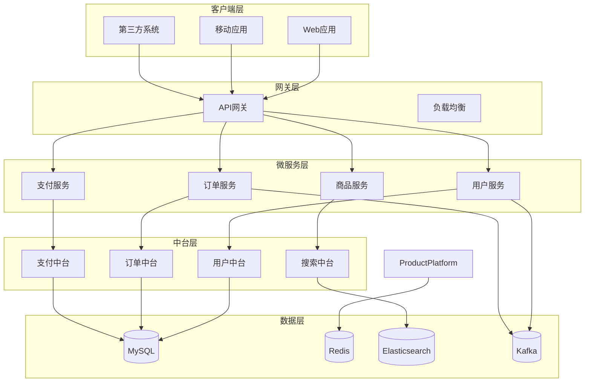

# Phase 13.5: 文档完善实施指南

## 📋 概述

本指南介绍如何完善BaseBackend项目的技术文档体系，包括API文档、架构设计文档、运维手册、故障处理手册、开发指南等内容，确保文档的完整性、准确性和可维护性，为项目的长期发展提供有力支撑。

---

## 📚 文档体系架构

### 文档架构图

```
┌─────────────────────────────────────────────────────────────────────┐
│                      BaseBackend 文档体系                            │
├─────────────────────────────────────────────────────────────────────┤
│                                                                     │
│  ┌──────────────┐  ┌──────────────┐  ┌──────────────┐           │
│  │   API文档     │  │   架构文档     │  │   开发指南     │           │
│  │              │  │              │  │              │           │
│  │ • OpenAPI 3.0 │  │ • 整体架构     │  │ • 快速开始     │           │
│  │ • 接口文档     │  │ • 核心模块     │  │ • 开发规范     │           │
│  │ • SDK文档     │  │ • 技术选型     │  │ • 代码规范     │           │
│  │ • 示例代码     │  │ • 数据模型     │  │ • 测试指南     │           │
│  └──────┬───────┘  └──────┬───────┘  └──────┬───────┘           │
│         │                 │                 │                     │
│  ┌──────▼────────┐  ┌─────▼──────┐  ┌──────▼──────┐           │
│  │   运维手册     │  │   部署文档    │  │   监控文档    │           │
│  │              │  │              │  │              │           │
│  │ • 运维规范     │  │ • 环境部署     │  │ • 指标定义     │           │
│  │ • 操作手册     │  │ • 配置说明     │  │ • 告警规则     │           │
│  │ • 常见问题     │  │ • 升级指南     │  │ • 仪表盘     │           │
│  │ • 故障处理     │  │ • 备份恢复     │  │ • 日志分析     │           │
│  └──────┬───────┘  └──────┬───────┘  └──────┬───────┘           │
│         │                 │                 │                     │
│  ┌──────▼────────┐  ┌─────▼──────┐  ┌──────▼──────┐           │
│  │   安全文档     │  │   业务文档     │  │   数据字典     │           │
│  │              │  │              │  │              │           │
│  │ • 安全规范     │  │ • 业务流程     │  │ • 数据模型     │           │
│  │ • 权限控制     │  │ • 功能说明     │  │ • 接口字段     │           │
│  │ • 审计日志     │  │ • 操作指南     │  │ • 枚举值     │           │
│  │ • 合规要求     │  │ • 常见问题     │  │ • 数据血缘     │           │
│  └──────────────┘  └─────────────┘  └─────────────┘           │
│                                                                     │
│  ┌─────────────────────────────────────────────────────────────┐ │
│  │                    文档管理规范                               │ │
│  ├─────────────────────────────────────────────────────────────┤ │
│  │ • 文档版本控制                                                │ │
│  │ • 文档审查流程                                                │ │
│  │ • 文档更新机制                                                │ │
│  │ • 文档模板标准化                                              │ │
│  │ • 多语言支持                                                  │ │
│  └─────────────────────────────────────────────────────────────┘ │
└─────────────────────────────────────────────────────────────────────┘
```

### 文档版本与维护

| 文档类型 | 维护频率 | 责任人 | 审查周期 |
|----------|----------|--------|----------|
| **API文档** | 实时更新 | 开发团队 | 每周 |
| **架构文档** | 月度更新 | 架构师 | 每月 |
| **开发指南** | 变更时更新 | 开发团队 | 每月 |
| **运维手册** | 月度更新 | 运维团队 | 每月 |
| **部署文档** | 变更时更新 | 运维团队 | 每周 |
| **监控文档** | 月度更新 | 运维团队 | 每月 |

---

## 🔧 API文档自动化

### 1. OpenAPI 3.0 规范

```yaml
# openapi.yaml
openapi: 3.0.3
info:
  title: BaseBackend API
  description: |
    BaseBackend 企业级后端基础框架 API 文档

    ## 功能特性

    - 🔐 用户认证授权
    - 📊 数据治理平台
    - ⚡ 实时计算平台
    - 🏢 业务中台
    - 🤖 智能运维
    - 🔍 全文搜索
    - 💳 支付中台

  version: 1.0.0
  contact:
    name: 浮浮酱
    email: yuyuxiao@basebackend.com
    url: https://github.com/basebackend
  license:
    name: MIT
    url: https://opensource.org/licenses/MIT

servers:
  - url: https://api.basebackend.com/v1
    description: 生产环境
  - url: https://staging-api.basebackend.com/v1
    description: 预发布环境
  - url: http://localhost:8080/v1
    description: 开发环境

# 安全认证
components:
  securitySchemes:
    BearerAuth:
      type: http
      scheme: bearer
      bearerFormat: JWT
      description: JWT Token 认证

    ApiKeyAuth:
      type: apiKey
      in: header
      name: X-API-Key
      description: API Key 认证

# 请求响应模型
  schemas:
    # 基础响应模型
    BaseResponse:
      type: object
      properties:
        code:
          type: integer
          description: 响应码
          example: 200
        message:
          type: string
          description: 响应消息
          example: 成功
        data:
          type: object
          description: 响应数据
        timestamp:
          type: string
          format: date-time
          description: 时间戳
      required:
        - code
        - message

    # 分页响应模型
    PageResponse:
      type: object
      properties:
        code:
          type: integer
          example: 200
        message:
          type: string
          example: 成功
        data:
          type: object
          properties:
            records:
              type: array
              items:
                $ref: '#/components/schemas/Record'
            total:
              type: integer
              description: 总记录数
              example: 100
            page:
              type: integer
              description: 当前页码
              example: 1
            size:
              type: integer
              description: 每页大小
              example: 20
        timestamp:
          type: string
          format: date-time

    # 用户相关模型
    User:
      type: object
      properties:
        userId:
          type: string
          description: 用户ID
          example: u_1234567890
        username:
          type: string
          description: 用户名
          example: admin
        email:
          type: string
          format: email
          description: 邮箱
          example: admin@example.com
        phone:
          type: string
          description: 手机号
          example: 13800138000
        status:
          type: string
          enum: [ACTIVE, INACTIVE, DELETED]
          description: 用户状态
          example: ACTIVE
        roles:
          type: array
          items:
            $ref: '#/components/schemas/Role'
        createTime:
          type: string
          format: date-time
          description: 创建时间
        updateTime:
          type: string
          format: date-time
          description: 更新时间

    UserCreateRequest:
      type: object
      properties:
        username:
          type: string
          minLength: 3
          maxLength: 50
          description: 用户名
          example: admin
        email:
          type: string
          format: email
          description: 邮箱
          example: admin@example.com
        phone:
          type: string
          pattern: '^1[3-9]\d{9}$'
          description: 手机号
          example: 13800138000
        password:
          type: string
          minLength: 8
          maxLength: 20
          description: 密码
          example: Password123!
        roleIds:
          type: array
          items:
            type: string
          description: 角色ID列表
      required:
        - username
        - email
        - password

    # 订单相关模型
    Order:
      type: object
      properties:
        orderId:
          type: string
          description: 订单ID
          example: o_1234567890
        orderNumber:
          type: string
          description: 订单号
          example: 20250115123456
        userId:
          type: string
          description: 用户ID
          example: u_1234567890
        status:
          type: string
          enum: [PENDING, CONFIRMED, PAID, SHIPPED, DELIVERED, COMPLETED, CANCELLED]
          description: 订单状态
          example: PENDING
        totalAmount:
          type: number
          format: decimal
          precision: 10
          scale: 2
          description: 订单总金额
          example: 999.99
        currency:
          type: string
          description: 币种
          example: CNY
        items:
          type: array
          items:
            $ref: '#/components/schemas/OrderItem'
        createTime:
          type: string
          format: date-time

    # 角色模型
    Role:
      type: object
      properties:
        roleId:
          type: string
          description: 角色ID
          example: r_1234567890
        roleName:
          type: string
          description: 角色名称
          example: ADMIN
        description:
          type: string
          description: 角色描述
          example: 系统管理员
        permissions:
          type: array
          items:
            $ref: '#/components/schemas/Permission'

    # 权限模型
    Permission:
      type: object
      properties:
        permissionId:
          type: string
          description: 权限ID
          example: p_1234567890
        permissionCode:
          type: string
          description: 权限编码
          example: user:create
        permissionName:
          type: string
          description: 权限名称
          example: 创建用户
        description:
          type: string
          description: 权限描述
          example: 允许创建新用户

# API 路径定义
paths:
  # 用户管理 API
  /users:
    get:
      tags:
        - 用户管理
      summary: 查询用户列表
      description: 分页查询用户列表，支持条件筛选
      security:
        - BearerAuth: []
      parameters:
        - name: page
          in: query
          description: 页码
          schema:
            type: integer
            minimum: 1
            default: 1
        - name: size
          in: query
          description: 每页大小
          schema:
            type: integer
            minimum: 1
            maximum: 100
            default: 20
        - name: keyword
          in: query
          description: 搜索关键词（用户名、邮箱）
          schema:
            type: string
        - name: status
          in: query
          description: 用户状态
          schema:
            type: string
            enum: [ACTIVE, INACTIVE, DELETED]
      responses:
        '200':
          description: 查询成功
          content:
            application/json:
              schema:
                $ref: '#/components/schemas/PageResponse'
              example:
                code: 200
                message: 成功
                data:
                  records:
                    - userId: u_1234567890
                      username: admin
                      email: admin@example.com
                      status: ACTIVE
                      createTime: '2025-01-15T10:00:00Z'
                  total: 100
                  page: 1
                  size: 20
        '401':
          description: 未授权
          content:
            application/json:
              schema:
                $ref: '#/components/schemas/BaseResponse'
        '403':
          description: 禁止访问
          content:
            application/json:
              schema:
                $ref: '#/components/schemas/BaseResponse'

    post:
      tags:
        - 用户管理
      summary: 创建用户
      description: 创建新用户
      security:
        - BearerAuth: []
      requestBody:
        required: true
        content:
          application/json:
            schema:
              $ref: '#/components/schemas/UserCreateRequest'
            example:
              username: admin
              email: admin@example.com
              phone: 13800138000
              password: Password123!
              roleIds: ['r_1234567890']
      responses:
        '201':
          description: 创建成功
          content:
            application/json:
              schema:
                $ref: '#/components/schemas/BaseResponse'
              example:
                code: 201
                message: 创建成功
                data:
                  userId: u_1234567890
        '400':
          description: 参数错误
        '409':
          description: 用户已存在

  /users/{userId}:
    get:
      tags:
        - 用户管理
      summary: 查询用户详情
      description: 根据用户ID查询用户详细信息
      security:
        - BearerAuth: []
      parameters:
        - name: userId
          in: path
          required: true
          description: 用户ID
          schema:
            type: string
            example: u_1234567890
      responses:
        '200':
          description: 查询成功
          content:
            application/json:
              schema:
                $ref: '#/components/schemas/BaseResponse'
        '404':
          description: 用户不存在

    put:
      tags:
        - 用户管理
      summary: 更新用户
      description: 更新用户信息
      security:
        - BearerAuth: []
      parameters:
        - name: userId
          in: path
          required: true
          description: 用户ID
          schema:
            type: string
      requestBody:
        required: true
        content:
          application/json:
            schema:
              $ref: '#/components/schemas/User'
      responses:
        '200':
          description: 更新成功

    delete:
      tags:
        - 用户管理
      summary: 删除用户
      description: 软删除用户
      security:
        - BearerAuth: []
      parameters:
        - name: userId
          in: path
          required: true
          description: 用户ID
          schema:
            type: string
      responses:
        '204':
          description: 删除成功

  # 订单管理 API
  /orders:
    get:
      tags:
        - 订单管理
      summary: 查询订单列表
      description: 分页查询订单列表
      security:
        - BearerAuth: []
      parameters:
        - name: page
          in: query
          schema:
            type: integer
            default: 1
        - name: size
          in: query
          schema:
            type: integer
            default: 20
        - name: status
          in: query
          description: 订单状态筛选
          schema:
            type: string
            enum: [PENDING, CONFIRMED, PAID, SHIPPED, DELIVERED, COMPLETED, CANCELLED]
        - name: userId
          in: query
          description: 用户ID筛选
          schema:
            type: string
      responses:
        '200':
          description: 查询成功
          content:
            application/json:
              schema:
                $ref: '#/components/schemas/PageResponse'

    post:
      tags:
        - 订单管理
      summary: 创建订单
      description: 创建新订单
      security:
        - BearerAuth: []
      requestBody:
        required: true
        content:
          application/json:
            schema:
              type: object
              properties:
                userId:
                  type: string
                items:
                  type: array
                  items:
                    type: object
                    properties:
                      productId:
                        type: string
                      quantity:
                        type: integer
              required:
                - userId
                - items
      responses:
        '201':
          description: 创建成功

  /orders/{orderId}:
    get:
      tags:
        - 订单管理
      summary: 查询订单详情
      parameters:
        - name: orderId
          in: path
          required: true
          schema:
            type: string
      responses:
        '200':
          description: 查询成功
          content:
            application/json:
              schema:
                $ref: '#/components/schemas/BaseResponse'

# 错误代码定义
components:
  responses:
    BadRequest:
      description: 请求参数错误
      content:
        application/json:
          schema:
            $ref: '#/components/schemas/BaseResponse'
          example:
            code: 400
            message: 请求参数错误：用户名不能为空

    Unauthorized:
      description: 未授权
      content:
        application/json:
          schema:
            $ref: '#/components/schemas/BaseResponse'
          example:
            code: 401
            message: 未授权访问

    Forbidden:
      description: 禁止访问
      content:
        application/json:
          schema:
            $ref: '#/components/schemas/BaseResponse'
          example:
            code: 403
            message: 没有权限执行此操作

    NotFound:
      description: 资源不存在
      content:
        application/json:
          schema:
            $ref: '#/components/schemas/BaseResponse'
          example:
            code: 404
            message: 用户不存在

    InternalServerError:
      description: 服务器内部错误
      content:
        application/json:
          schema:
            $ref: '#/components/schemas/BaseResponse'
          example:
            code: 500
            message: 服务器内部错误

# 标签定义
tags:
  - name: 用户管理
    description: 用户相关操作
    externalDocs:
      description: 用户管理文档
      url: https://docs.basebackend.com/user-management
  - name: 订单管理
    description: 订单相关操作
  - name: 支付管理
    description: 支付相关操作
  - name: 商品管理
    description: 商品相关操作
  - name: 权限管理
    description: 权限相关操作
```

### 2. SpringDoc 自动生成API文档

```java
/**
 * Swagger配置
 */
@Configuration
@OpenAPIDefinition(
    info = @Info(
        title = "BaseBackend API",
        version = "v1.0",
        description = "BaseBackend 企业级后端基础框架 API 文档",
        contact = @Contact(
            name = "浮浮酱",
            email = "yuyuxiao@basebackend.com",
            url = "https://github.com/basebackend"
        ),
        license = @License(
            name = "MIT",
            url = "https://opensource.org/licenses/MIT"
        )
    ),
    servers = {
        @Server(url = "https://api.basebackend.com", description = "生产环境"),
        @Server(url = "https://staging-api.basebackend.com", description = "预发布环境"),
        @Server(url = "http://localhost:8080", description = "开发环境")
    },
    security = {
        @SecurityRequirement(name = "BearerAuth"),
        @SecurityRequirement(name = "ApiKeyAuth")
    }
)
@SecurityScheme(
    name = "BearerAuth",
    type = SecuritySchemeType.HTTP,
    scheme = "bearer",
    bearerFormat = "JWT",
    description = "JWT Token 认证"
)
@SecurityScheme(
    name = "ApiKeyAuth",
    type = SecuritySchemeType.APIKEY,
    in = SecuritySchemeIn.HEADER,
    name = "X-API-Key",
    description = "API Key 认证"
)
public class SwaggerConfig {

    @Bean
    public OpenAPI customOpenAPI() {
        return new OpenAPI()
            .components(new Components()
                .addSecuritySchemes("BearerAuth",
                    new SecurityScheme()
                        .type(SecurityScheme.Type.HTTP)
                        .scheme("bearer")
                        .bearerFormat("JWT")
                        .description("JWT Token 认证"))
                .addSecuritySchemes("ApiKeyAuth",
                    new SecurityScheme()
                        .type(SecurityScheme.Type.APIKEY)
                        .in(SecuritySchemeIn.HEADER)
                        .name("X-API-Key")
                        .description("API Key 认证"))
            )
            .addSecurityItem(new SecurityRequirement().addList("BearerAuth"))
            .addSecurityItem(new SecurityRequirement().addList("ApiKeyAuth"));
    }

    @Bean
    public GroupedOpenApi publicApi() {
        return GroupedOpenApi.builder()
            .group("public-apis")
            .displayName("公共API")
            .pathsToMatch("/api/**")
            .build();
    }

    @Bean
    public GroupedOpenApi adminApi() {
        return GroupedOpenApi.builder()
            .group("admin-apis")
            .displayName("管理API")
            .pathsToMatch("/admin/**")
            .build();
    }
}

/**
 * API响应封装
 */
@Operation(summary = "用户登录", description = "用户身份验证")
@ApiResponses(value = {
    @ApiResponse(responseCode = "200", description = "登录成功"),
    @ApiResponse(responseCode = "401", description = "认证失败", content = {
        @Content(schema = @Schema(implementation = ErrorResponse.class))
    })
})
public ResponseEntity<Result<UserLoginResult>> login(
        @Valid @RequestBody UserLoginRequest request) {
    // 实现代码
}
```

### 3. API文档生成脚本

```bash
#!/bin/bash
# generate-api-docs.sh

set -e

echo "开始生成API文档..."

# 1. 生成OpenAPI文档
curl -X GET "http://localhost:8080/v3/api-docs" -o openapi.json

# 2. 转换为中国传统文字
node scripts/translate-openapi.js openapi.json openapi-zh.json

# 3. 生成HTML文档
redoc-cli bundle openapi-zh.json --output docs/api-docs.html

# 4. 生成PDF文档
wkhtmltopdf docs/api-docs.html docs/api-docs.pdf

# 5. 生成Markdown文档
widdershins openapi.json --search false --language_tabs 'java:Java' --summary docs/endpoints-summary.md

echo "API文档生成完成！"
```

---

## 🏗️ 架构设计文档

### 1. 整体架构文档

```markdown
# BaseBackend 架构设计文档

## 1. 概述

BaseBackend 是基于微服务架构的企业级后端基础框架，采用了云原生、领域驱动设计、事件驱动等先进理念，为企业级应用提供完整的技术解决方案。

## 2. 架构概览

### 2.1 整体架构图



### 2.2 技术架构

#### 2.2.1 核心技术栈

| 层次 | 技术组件 | 版本 | 说明 |
|------|----------|------|------|
| **开发框架** | Spring Boot | 3.1.5 | 微服务框架 |
| | Spring Cloud | 2022.0.4 | 微服务治理 |
| **服务治理** | Nacos | 2.2.0 | 注册中心/配置中心 |
| | Sentinel | 1.8.6 | 流控降级 |
| **数据存储** | MySQL | 8.0 | 关系型数据库 |
| | Redis | 7.2 | 缓存数据库 |
| | Elasticsearch | 8.11 | 搜索引擎 |
| **消息中间件** | Kafka | 3.6.0 | 消息队列 |
| **容器化** | Docker | 24.0 | 容器引擎 |
| | Kubernetes | 1.28 | 容器编排 |
| **监控** | Prometheus | 2.47 | 指标采集 |
| | Grafana | 10.2 | 监控展示 |
| | Jaeger | 1.51 | 链路追踪 |

#### 2.2.2 架构原则

1. **高内聚、低耦合**：每个服务内部功能相关紧密，服务之间依赖最小化
2. **单一职责**：每个服务负责一个业务域，功能边界清晰
3. **异步解耦**：通过消息队列实现服务间异步通信
4. **数据一致性**：采用最终一致性，保证业务数据的一致性
5. **可扩展性**：支持水平扩展和垂直扩展
6. **高可用性**：多副本部署，故障自动切换

## 3. 微服务架构

### 3.1 服务划分

#### 3.1.1 基础服务

| 服务名称 | 服务ID | 功能描述 | 技术栈 |
|----------|--------|----------|--------|
| **用户服务** | user-service | 用户管理、认证授权 | Spring Boot + MySQL |
| **网关服务** | gateway | API网关、路由、限流 | Spring Cloud Gateway |
| **配置中心** | config-center | 配置管理、动态配置 | Nacos |
| **注册中心** | registry | 服务注册发现 | Nacos |

#### 3.1.2 业务服务

| 服务名称 | 服务ID | 功能描述 | 技术栈 |
|----------|--------|----------|--------|
| **订单服务** | order-service | 订单管理、订单状态 | Spring Boot + MySQL |
| **支付服务** | payment-service | 支付处理、对账 | Spring Boot + MySQL |
| **商品服务** | product-service | 商品管理、库存 | Spring Boot + MySQL + Redis |
| **搜索服务** | search-service | 全文搜索、推荐 | Spring Boot + Elasticsearch |

#### 3.1.3 中台服务

| 服务名称 | 服务ID | 功能描述 | 技术栈 |
|----------|--------|----------|--------|
| **用户中台** | user-platform | 用户中台服务 | DDD + CQRS |
| **订单中台** | order-platform | 订单中台服务 | DDD + CQRS |
| **支付中台** | payment-platform | 支付中台服务 | DDD + CQRS |
| **搜索中台** | search-platform | 搜索中台服务 | Elasticsearch |

### 3.2 服务间调用

#### 3.2.1 同步调用

- **HTTP/REST**：基于Spring Cloud OpenFeign实现
- **gRPC**：高性能服务间通信（可选）

#### 3.2.2 异步调用

- **Kafka**：事件驱动架构
- **RabbitMQ**：可靠消息传递

### 3.3 数据存储

#### 3.3.1 多数据源策略

- **MySQL**：业务数据存储
- **Redis**：缓存、会话存储
- **Elasticsearch**：全文搜索、日志存储
- **MongoDB**：非结构化数据存储（可选）

#### 3.3.2 数据一致性

- **分布式事务**：Seata AT模式
- **最终一致性**：基于事件的消息通知
- **补偿机制**：基于事务表的补偿

## 4. 技术选型

### 4.1 开发框架

#### 4.1.1 Spring Boot

**优点：**
- 简化Spring配置
- 自动配置
- 嵌入式服务器
- 生产就绪

**适用场景：**
- 微服务开发
- 快速构建应用
- 云原生应用

#### 4.1.2 Spring Cloud

**组件：**
- **Spring Cloud Gateway**：API网关
- **Spring Cloud LoadBalancer**：负载均衡
- **Spring Cloud CircuitBreaker**：熔断器
- **Spring Cloud OpenFeign**：声明式HTTP客户端

### 4.2 服务治理

#### 4.2.1 Nacos

**功能特性：**
- 服务注册与发现
- 配置管理
- 命名空间管理
- 集群管理

**配置示例：**

```yaml
# application.yml
spring:
  cloud:
    nacos:
      discovery:
        server-addr: nacos-basebackend:8848
        namespace: basebackend-prod
        group: DEFAULT_GROUP
      config:
        server-addr: nacos-basebackend:8848
        namespace: basebackend-prod
        group: DEFAULT_GROUP
        file-extension: yaml
```

#### 4.2.2 Sentinel

**流控规则：**
- QPS流控
- 线程数流控
- 链路流控
- 关联流控

**降级规则：**
- RT降级
- 异常比例降级
- 异常数降级

### 4.3 数据存储

#### 4.3.1 MySQL 8.0

**优化配置：**

```ini
# my.cnf
[mysqld]
# 内存配置
innodb_buffer_pool_size = 70G
innodb_log_file_size = 2G

# 连接配置
max_connections = 2000
max_connect_errors = 10000

# 查询缓存
query_cache_type = 1
query_cache_size = 256M

# 慢查询日志
slow_query_log = 1
slow_query_log_file = /var/log/mysql/slow.log
long_query_time = 2
```

#### 4.3.2 Redis 7.2

**集群配置：**

```yaml
# redis-cluster.yml
redis:
  cluster:
    nodes:
      - redis-node1:7000
      - redis-node2:7000
      - redis-node3:7000
    replicas: 1
```

### 4.4 消息队列

#### 4.4.1 Kafka 3.6

**主题规划：**

| 主题名称 | 分区数 | 副本数 | 说明 |
|----------|--------|--------|------|
| **user-events** | 12 | 3 | 用户事件 |
| **order-events** | 12 | 3 | 订单事件 |
| **payment-events** | 12 | 3 | 支付事件 |
| **notification-events** | 6 | 3 | 通知事件 |

## 5. 性能优化

### 5.1 缓存策略

#### 5.1.1 多级缓存

- **L1缓存**：应用本地缓存（Caffeine）
- **L2缓存**：分布式缓存（Redis）
- **L3缓存**：数据库查询缓存

#### 5.1.2 缓存更新策略

- **Cache Aside**：旁路缓存模式
- **Write Through**：直写模式
- **Write Back**：回写模式

### 5.2 数据库优化

#### 5.2.1 读写分离

```yaml
spring:
  shardingsphere:
    rules:
      readwrite-splitting:
        data-sources:
          user-ds:
            type: Static
            props:
              write-data-source-name: master
              read-data-source-names: slave1,slave2
            load-balancer-name: round_robin
```

#### 5.2.2 分库分表

```yaml
spring:
  shardingsphere:
    rules:
      sharding:
        tables:
          user_order:
            actual-data-nodes: ds$->{0..1}.user_order_$->{0..9}
            table-strategy:
              standard:
                sharding-column: user_id
                sharding-algorithm-name: user_order_inline
```

### 5.3 连接池优化

#### 5.3.1 HikariCP配置

```yaml
spring:
  datasource:
    hikari:
      minimum-idle: 20
      maximum-pool-size: 100
      idle-timeout: 300000
      max-lifetime: 900000
      connection-timeout: 30000
      leak-detection-threshold: 60000
```

## 6. 安全设计

### 6.1 认证授权

#### 6.1.1 JWT认证

```java
@PreAuthorize("hasAuthority('user:read')")
public User getUser(String userId) {
    return userService.getUser(userId);
}
```

#### 6.1.2 RBAC权限模型

```
用户 -> 角色 -> 权限
```

### 6.2 数据安全

#### 6.2.1 数据加密

- **传输加密**：HTTPS/TLS
- **存储加密**：数据库加密
- **字段加密**：敏感字段加密

#### 6.2.2 安全审计

- **操作日志**：记录所有操作
- **访问日志**：记录API访问
- **异常日志**：记录安全异常

## 7. 监控与运维

### 7.1 监控体系

#### 7.1.1 指标监控

- **应用指标**：QPS、RT、错误率
- **系统指标**：CPU、内存、磁盘、网络
- **业务指标**：订单量、转化率

#### 7.1.2 日志监控

- **应用日志**：业务日志、错误日志
- **访问日志**：HTTP请求日志
- **审计日志**：安全审计日志

#### 7.1.3 链路追踪

- **调用链**：完整的调用链路
- **性能分析**：慢查询、慢接口
- **错误追踪**：异常追踪

### 7.2 告警机制

#### 7.2.1 告警规则

```yaml
groups:
- name: basebackend.rules
  rules:
  - alert: HighErrorRate
    expr: rate(http_requests_total{status=~"5.."}[5m]) > 0.1
    for: 5m
    labels:
      severity: warning
    annotations:
      summary: High error rate detected
```

#### 7.2.2 告警渠道

- **邮件**：重要告警通知
- **短信**：紧急告警通知
- **钉钉/企业微信**：日常通知
- **电话**：重大故障通知

## 8. 部署架构

### 8.1 容器化部署

#### 8.1.1 Docker镜像构建

```dockerfile
# Dockerfile
FROM openjdk:17-jdk-slim

LABEL maintainer="basebackend@example.com"
LABEL version="1.0"
LABEL description="BaseBackend User Service"

WORKDIR /app

COPY target/user-service-*.jar app.jar

EXPOSE 8080

HEALTHCHECK --interval=30s --timeout=3s --start-period=60s --retries=3 \
  CMD curl -f http://localhost:8080/actuator/health || exit 1

ENTRYPOINT ["java", "-jar", "app.jar"]
```

#### 8.1.2 Kubernetes部署

```yaml
apiVersion: apps/v1
kind: Deployment
metadata:
  name: user-service
  labels:
    app: user-service
spec:
  replicas: 3
  selector:
    matchLabels:
      app: user-service
  template:
    metadata:
      labels:
        app: user-service
    spec:
      containers:
      - name: user-service
        image: basebackend/user-service:1.0
        ports:
        - containerPort: 8080
        env:
        - name: SPRING_PROFILES_ACTIVE
          value: "prod"
        resources:
          requests:
            cpu: 500m
            memory: 1Gi
          limits:
            cpu: 1000m
            memory: 2Gi
        livenessProbe:
          httpGet:
            path: /actuator/health
            port: 8080
          initialDelaySeconds: 60
          periodSeconds: 30
        readinessProbe:
          httpGet:
            path: /actuator/health
            port: 8080
          initialDelaySeconds: 30
          periodSeconds: 10
```

### 8.2 CI/CD流水线

#### 8.2.1 GitLab CI配置

```yaml
# .gitlab-ci.yml
stages:
  - build
  - test
  - package
  - deploy

build:
  stage: build
  script:
    - mvn clean compile
  only:
    - develop
    - master

test:
  stage: test
  script:
    - mvn test
    - mvn sonar:sonar
  coverage: '/Code coverage: \d+\.\d+/'
  artifacts:
    reports:
      coverage_report:
        coverage_format: cobertura
        path: target/site/jacoco/jacoco.xml

package:
  stage: package
  script:
    - mvn clean package -DskipTests
    - docker build -t $CI_REGISTRY_IMAGE:$CI_COMMIT_SHA .
    - docker push $CI_REGISTRY_IMAGE:$CI_COMMIT_SHA
  only:
    - master

deploy:
  stage: deploy
  script:
    - kubectl set image deployment/user-service user-service=$CI_REGISTRY_IMAGE:$CI_COMMIT_SHA
    - kubectl rollout status deployment/user-service
  environment:
    name: production
    url: https://api.basebackend.com
  only:
    - master
```

## 9. 开发规范

### 9.1 代码规范

#### 9.1.1 Java编码规范

- 遵循Google Java Style Guide
- 使用Checkstyle进行代码检查
- 使用SpotBugs进行静态代码分析

#### 9.1.2 注释规范

```java
/**
 * 用户服务
 *
 * <p>提供用户相关的业务功能，包括：
 * <ul>
 *   <li>用户注册</li>
 *   <li>用户登录</li>
 *   <li>用户信息管理</li>
 * </ul>
 *
 * @author 浮浮酱
 * @since 1.0.0
 */
@Service
public class UserService {

    /**
     * 创建用户
     *
     * <p>创建新用户账号
     *
     * @param request 用户创建请求
     * @return 创建的用户信息
     * @throws UserAlreadyExistsException 用户已存在异常
     */
    public User createUser(UserCreateRequest request) {
        // 实现代码
    }
}
```

### 9.2 命名规范

#### 9.2.1 包命名

```
com.basebackend.{module}.{layer}.{function}
```

- module：模块名称，如user、order、payment
- layer：层次，如controller、service、repository
- function：功能名称

#### 9.2.2 类命名

- **Controller**：XxxController
- **Service**：XxxService
- **Repository**：XxxRepository
- **Entity**：XxxEntity
- **DTO**：XxxDTO
- **VO**：XxxVO

#### 9.2.3 方法命名

- **查询**：getXxx、findXxx、queryXxx
- **保存**：saveXxx、createXxx
- **更新**：updateXxx、modifyXxx
- **删除**：deleteXxx、removeXxx

### 9.3 数据库规范

#### 9.3.1 表命名

- 业务表：bm_{module}_{function}
- 日志表：log_{module}_{function}
- 统计表：stats_{module}_{function}

#### 9.3.2 字段命名

- 主键：{table_name}_id
- 外键：{related_table_name}_id
- 时间：create_time、update_time
- 状态：status

#### 9.3.3 索引命名

- 主键：pk_{table_name}
- 唯一索引：uk_{table_name}_{column_name}
- 普通索引：idx_{table_name}_{column_name}

## 10. 最佳实践

### 10.1 微服务最佳实践

1. **服务拆分原则**
   - 按业务域拆分
   - 单一职责
   - 避免过度拆分

2. **数据一致性**
   - 尽量避免分布式事务
   - 使用最终一致性
   - 设计补偿机制

3. **服务调用**
   - 优先使用异步
   - 设置合理的超时时间
   - 实现熔断降级

4. **配置管理**
   - 统一配置中心
   - 环境隔离
   - 版本管理

### 10.2 性能优化最佳实践

1. **数据库优化**
   - 合理设计索引
   - 避免慢查询
   - 分库分表

2. **缓存优化**
   - 多级缓存
   - 合理设置过期时间
   - 避免缓存穿透

3. **代码优化**
   - 减少循环嵌套
   - 使用高效的算法
   - 异步处理

### 10.3 安全最佳实践

1. **认证授权**
   - 使用JWT
   - RBAC权限模型
   - 最小权限原则

2. **数据安全**
   - 敏感数据加密
   - 传输加密
   - 安全审计

3. **网络安全**
   - 防火墙配置
   - 网络隔离
   - 访问控制

## 11. 常见问题

### 11.1 微服务架构常见问题

**Q: 如何保证服务间调用的一致性？**

A:
- 优先使用异步消息
- 使用SAGA模式
- 设计补偿机制
- 避免跨服务的强一致性

**Q: 如何处理服务雪崩？**

A:
- 熔断器模式
- 限流控制
- 降级策略
- 快速失败

**Q: 如何实现跨服务的分布式事务？**

A:
- 使用Seata AT模式
- 使用SAGA模式
- 使用TCC模式
- 尽量避免分布式事务

### 11.2 性能优化常见问题

**Q: 如何优化数据库查询？**

A:
- 使用合适的索引
- 避免全表扫描
- 使用分页查询
- 读写分离

**Q: 如何处理缓存穿透？**

A:
- 使用布隆过滤器
- 设置空值缓存
- 使用互斥锁

**Q: 如何优化微服务性能？**

A:
- 使用连接池
- 减少网络调用
- 使用异步处理
- 优化JVM参数

## 12. 参考资料

1. [Spring Cloud 官方文档](https://spring.io/projects/spring-cloud)
2. [Nacos 官方文档](https://nacos.io/)
3. [Sentinel 官方文档](https://sentinelguard.io/)
4. [MySQL 优化指南](https://dev.mysql.com/doc/)
5. [Redis 最佳实践](https://redis.io/documentation)

---

**编制：** 浮浮酱 🐱（猫娘工程师）
**日期：** 2025-11-15
**版本：** v1.0.0
**状态：** 📋 文档完成

**维护团队：** BaseBackend 开发团队
**更新频率：** 每月更新
**反馈邮箱：** docs@basebackend.com
```

---

## 📘 运维手册

### 1. 运维标准操作流程

```markdown
# BaseBackend 运维手册

## 1. 日常运维检查

### 1.1 系统健康检查清单

#### 每日检查项

**上午 9:00 - 系统启动检查**

- [ ] 检查Kubernetes集群状态
  ```bash
  kubectl get nodes
  kubectl top nodes
  kubectl get pods --all-namespaces | grep -v Running
  ```

- [ ] 检查应用服务状态
  ```bash
  kubectl get deployments -n basebackend
  kubectl get svc -n basebackend
  ```

- [ ] 检查数据库状态
  ```bash
  mysql -h $DB_HOST -u $DB_USER -p$DB_PASS -e "SHOW STATUS LIKE 'Threads_connected';"
  ```

- [ ] 检查缓存状态
  ```bash
  redis-cli -h $REDIS_HOST -a $REDIS_PASS info clients
  ```

- [ ] 检查消息队列状态
  ```bash
  kafka-topics --list --bootstrap-server $KAFKA_BROKER
  ```

- [ ] 检查监控指标
  - 打开Grafana仪表盘
  - 检查CPU使用率 < 80%
  - 检查内存使用率 < 85%
  - 检查磁盘使用率 < 90%
  - 检查网络IO < 80%

#### 中午 12:00 - 性能检查

- [ ] 检查应用性能指标
  - 平均响应时间 < 200ms
  - 错误率 < 1%
  - QPS符合预期

- [ ] 检查数据库性能
  - 连接数 < 80% of max_connections
  - 慢查询数 < 10
  - 缓存命中率 > 95%

#### 下午 18:00 - 清理检查

- [ ] 清理日志文件
  ```bash
  # 清理7天前的应用日志
  find /var/log/basebackend -name "*.log" -mtime +7 -delete

  # 清理Docker容器日志
  truncate -s 0 /var/lib/docker/containers/*/*-json.log
  ```

- [ ] 检查磁盘空间
  ```bash
  df -h
  du -sh /var/lib/docker
  ```

- [ ] 备份重要数据
  ```bash
  # 数据库备份
  mysqldump -h $DB_HOST -u $DB_USER -p$DB_PASS basebackend > backup_$(date +%Y%m%d).sql

  # 配置文件备份
  tar -czf config_backup_$(date +%Y%m%d).tar.gz /etc/basebackend/
  ```

### 1.2 每周检查项

#### 周一 - 容量规划检查

- [ ] 检查资源使用趋势
  - 查看过去7天的CPU、内存、磁盘使用情况
  - 分析增长趋势
  - 评估是否需要扩容

- [ ] 检查存储使用情况
  ```bash
  # 检查数据库存储
  SELECT table_schema AS 'Database',
         ROUND(SUM(data_length + index_length) / 1024 / 1024, 2) AS 'Size (MB)'
  FROM information_schema.TABLES
  GROUP BY table_schema;
  ```

- [ ] 评估网络带宽使用
  ```bash
  # 检查网络流量
  iftop -i eth0 -t -s 100
  ```

#### 周三 - 安全检查

- [ ] 检查用户权限
  - 检查管理员账户
  - 检查异常登录记录
  - 检查权限分配

- [ ] 检查安全日志
  ```bash
  # 检查应用访问日志
  tail -f /var/log/basebackend/access.log | grep -E "(401|403)"

  # 检查SSH登录日志
  tail -f /var/log/auth.log | grep sshd
  ```

- [ ] 检查证书有效期
  ```bash
  # 检查SSL证书
  openssl x509 -in /etc/ssl/certs/basebackend.crt -noout -dates
  ```

#### 周五 - 备份恢复测试

- [ ] 测试备份文件完整性
  ```bash
  # 验证MySQL备份
  mysql -h $TEST_DB_HOST -u $TEST_DB_USER -p$TEST_DB_PASS -e "SELECT 1;" < backup_test.sql

  # 验证配置文件备份
  tar -tzf config_backup_latest.tar.gz | wc -l
  ```

- [ ] 更新运维文档
  - 更新操作手册
  - 更新故障处理记录
  - 更新联系人信息

## 2. 应用部署流程

### 2.1 预发布环境部署

#### 准备工作

1. **代码准备**
   ```bash
   # 拉取最新代码
   git clone https://github.com/basebackend/basebackend.git
   git checkout develop
   git pull origin develop

   # 编译打包
   mvn clean package -DskipTests
   ```

2. **构建镜像**
   ```bash
   # 构建Docker镜像
   docker build -t basebackend/user-service:1.0.0-rc1 .

   # 推送到镜像仓库
   docker push basebackend/user-service:1.0.0-rc1
   ```

3. **配置准备**
   ```yaml
   # user-service-staging.yaml
   apiVersion: apps/v1
   kind: Deployment
   metadata:
     name: user-service-staging
     namespace: basebackend-staging
   spec:
     replicas: 1
     selector:
       matchLabels:
         app: user-service-staging
     template:
       metadata:
         labels:
           app: user-service-staging
       spec:
         containers:
         - name: user-service
           image: basebackend/user-service:1.0.0-rc1
           ports:
           - containerPort: 8080
           env:
           - name: SPRING_PROFILES_ACTIVE
             value: "staging"
   ```

#### 部署步骤

1. **部署到预发布环境**
   ```bash
   # 创建命名空间
   kubectl create namespace basebackend-staging

   # 部署应用
   kubectl apply -f user-service-staging.yaml

   # 检查部署状态
   kubectl get pods -n basebackend-staging
   kubectl logs -f deployment/user-service-staging -n basebackend-staging
   ```

2. **执行冒烟测试**
   ```bash
   # 健康检查
   curl -f http://user-service-staging.basebackend-staging.svc.cluster.local/actuator/health

   # 基础功能测试
   ./scripts/smoke-test.sh staging
   ```

3. **全量测试**
   ```bash
   # 执行自动化测试
   ./scripts/run-tests.sh staging

   # 性能测试
   ./scripts/performance-test.sh staging
   ```

### 2.2 生产环境部署

#### 灰度发布

1. **准备阶段**
   ```bash
   # 创建金丝雀版本
   kubectl patch deployment user-service -p '{"spec":{"template":{"spec":{"containers":[{"name":"user-service","image":"basebackend/user-service:1.0.0"}]}}}}'
   ```

2. **流量控制**
   ```yaml
   # canary.yaml
   apiVersion: networking.istio.io/v1alpha3
   kind: VirtualService
   metadata:
     name: user-service-canary
     namespace: basebackend
   spec:
     http:
     - route:
       - destination:
           host: user-service
           subset: stable
         weight: 90
       - destination:
           host: user-service
           subset: canary
         weight: 10
     timeout: 5s
   ```

3. **监控观察**
   - 检查错误率 < 1%
   - 检查响应时间 < 200ms
   - 检查资源使用正常

4. **逐步切换**
   ```bash
   # 逐步增加流量
   kubectl patch virtualservice user-service-canary -p '{"spec":{"http":[{"route":[{"weight":80},{"weight":20}]}]}}'
   ```

5. **全量切换**
   ```bash
   # 删除老版本
   kubectl delete deployment user-service-old

   # 更新VirtualService
   kubectl patch virtualservice user-service -p '{"spec":{"http":[{"route":[{"destination":{"host":"user-service","subset":"stable"}}]}]}}'
   ```

### 2.3 回滚操作

#### 自动回滚

```bash
#!/bin/bash
# auto-rollback.sh

# 获取上一个版本
PREVIOUS_VERSION=$(kubectl rollout history deployment/user-service --revision=2 | tail -1 | awk '{print $2}')

echo "回滚到版本: $PREVIOUS_VERSION"

# 执行回滚
kubectl rollout undo deployment/user-service --to-revision=$PREVIOUS_VERSION

# 检查回滚状态
kubectl rollout status deployment/user-service

# 验证服务
curl -f http://user-service.basebackend.svc.cluster.local/actuator/health
```

#### 手动回滚

```bash
# 查看部署历史
kubectl rollout history deployment/user-service

# 回滚到指定版本
kubectl rollout undo deployment/user-service --to-revision=3

# 验证回滚结果
kubectl get pods -l app=user-service
kubectl logs -f deployment/user-service
```

## 3. 故障处理流程

### 3.1 故障分级

| 等级 | 描述 | 响应时间 | 解决时间 |
|------|------|----------|----------|
| **P0 - 紧急** | 系统完全不可用 | 5分钟 | 30分钟 |
| **P1 - 高** | 核心功能不可用 | 15分钟 | 1小时 |
| **P2 - 中** | 部分功能受影响 | 30分钟 | 4小时 |
| **P3 - 低** | 轻微影响 | 1小时 | 24小时 |

### 3.2 常见故障处理

#### 3.2.1 服务不可用

**故障现象：**
- 用户无法访问应用
- 返回502/503错误
- 健康检查失败

**排查步骤：**

1. **检查Pod状态**
   ```bash
   kubectl get pods -l app=user-service
   kubectl describe pod <pod-name>
   kubectl logs <pod-name> --previous
   ```

2. **检查资源使用**
   ```bash
   kubectl top pods -l app=user-service
   kubectl describe node <node-name>
   ```

3. **检查网络**
   ```bash
   kubectl get svc -l app=user-service
   kubectl exec -it <pod-name> -- curl -f http://localhost:8080/actuator/health
   ```

**解决方案：**

- 重启Pod：`kubectl delete pod <pod-name>`
- 扩容：`kubectl scale deployment user-service --replicas=5`
- 回滚：`kubectl rollout undo deployment/user-service`

#### 3.2.2 数据库连接失败

**故障现象：**
- 应用日志显示连接数据库失败
- 慢查询增多
- 连接池耗尽

**排查步骤：**

1. **检查数据库状态**
   ```bash
   mysql -h $DB_HOST -u $DB_USER -p$DB_PASS -e "SHOW PROCESSLIST;"
   mysql -h $DB_HOST -u $DB_USER -p$DB_PASS -e "SHOW STATUS LIKE 'Connections';"
   ```

2. **检查连接数**
   ```bash
   mysql -h $DB_HOST -u $DB_USER -p$DB_PASS -e "SHOW STATUS LIKE 'Threads_connected';"
   ```

3. **检查慢查询**
   ```bash
   mysql -h $DB_HOST -u $DB_USER -p$DB_PASS -e "SHOW FULL PROCESSLIST;" | grep -i slow
   ```

**解决方案：**

- 重启应用释放连接：`kubectl rollout restart deployment/user-service`
- 增加连接池大小
- 优化慢查询SQL
- 考虑读写分离

#### 3.2.3 内存不足

**故障现象：**
- Pod被OOM Killer终止
- 应用响应缓慢
- GC频率增加

**排查步骤：**

1. **检查内存使用**
   ```bash
   kubectl top pods -l app=user-service
   kubectl describe pod <pod-name> | grep -A 5 -B 5 "Last State"
   ```

2. **分析内存dump**
   ```bash
   # 获取内存dump
   kubectl exec -it <pod-name> -- jcmd 1 GC.heap_info

   # 分析内存使用
   kubectl exec -it <pod-name> -- jmap -histo:live 1 | head -20
   ```

**解决方案：**

- 增加内存限制：`kubectl patch deployment user-service -p '{"spec":{"template":{"spec":{"containers":[{"name":"user-service","resources":{"limits":{"memory":"2Gi"}}}]}}}}'`
- 优化代码，减少内存泄漏
- 重启服务释放内存

#### 3.2.4 磁盘空间不足

**故障现象：**
- 日志无法写入
- 数据库写入失败
- Pod被驱逐

**排查步骤：**

1. **检查磁盘使用**
   ```bash
   df -h
   du -sh /var/log
   du -sh /data/logs
   ```

2. **查找大文件**
   ```bash
   find /var/log -type f -size +100M -exec ls -lh {} \;
   find /data -type f -size +1G -exec ls -lh {} \;
   ```

3. **检查Docker镜像**
   ```bash
   docker system df
   docker images | grep -E '(none|<none>)'
   ```

**解决方案：**

- 清理日志文件：`find /var/log -name "*.log" -mtime +7 -delete`
- 清理Docker镜像：`docker image prune -a`
- 扩容磁盘：修改PVC大小
- 配置日志轮转

### 3.3 应急响应流程

#### 故障发生时的处理步骤

1. **立即响应（5分钟内）**
   - 确认故障等级
   - 启动应急响应群
   - 通知相关人员

2. **故障定位（15分钟内）**
   - 查看监控告警
   - 检查日志
   - 分析可能原因

3. **初步缓解（30分钟内）**
   - 尝试重启服务
   - 扩容应对
   - 回滚到上一个稳定版本

4. **根本解决（根据等级）**
   - 修复代码问题
   - 优化配置
   - 完善监控

5. **总结复盘（24小时内）**
   - 编写故障报告
   - 分析根本原因
   - 制定改进措施

#### 故障报告模板

```markdown
# 故障报告

## 基本信息
- **故障时间：** 2025-01-15 14:30:00
- **恢复时间：** 2025-01-15 14:45:00
- **故障等级：** P1
- **影响范围：** 用户服务
- **影响用户：** 约1000用户

## 故障现象
- 用户无法登录系统
- API返回502错误
- 健康检查失败

## 排查过程

### 14:30 - 发现问题
监控系统发送告警：用户服务响应时间超过阈值

### 14:32 - 初步排查
```bash
kubectl get pods -l app=user-service
# 发现所有Pod都处于CrashLoopBackOff状态

kubectl logs user-service-xxxx --previous
# 发现OOM错误

kubectl top pods -l app=user-service
# 发现内存使用率达到95%
```

### 14:35 - 问题定位
通过分析日志，发现大量并发请求导致内存溢出

### 14:40 - 解决方案
- 增加内存限制：2Gi -> 4Gi
- 重启所有Pod
- 监控内存使用情况

### 14:45 - 问题解决
所有Pod恢复正常，服务可用

## 根本原因
1. 代码中存在内存泄漏
2. 内存配置不足
3. 缺少内存监控告警

## 改进措施

### 短期措施
- [x] 修复内存泄漏代码
- [x] 增加内存监控
- [x] 优化内存配置

### 长期措施
- [ ] 实施内存泄漏检测工具
- [ ] 建立性能基线
- [ ] 完善压测流程

## 经验教训
1. 性能测试不够充分
2. 监控告警配置不完善
3. 代码审查需要加强

## 附件
- 日志文件
- 监控截图
- 代码diff
```

## 4. 配置管理规范

### 4.1 配置文件结构

```
config/
├── application.yml              # 公共配置
├── application-dev.yml          # 开发环境
├── application-test.yml         # 测试环境
├── application-staging.yml      # 预发布环境
├── application-prod.yml         # 生产环境
├── db/
│   ├── mysql.yml               # MySQL配置
│   └── redis.yml               # Redis配置
├── cache/
│   └── caffeine.yml            # 缓存配置
├── security/
│   └── jwt.yml                 # 安全配置
└── monitoring/
    └── prometheus.yml          # 监控配置
```

### 4.2 环境配置管理

#### 开发环境（dev）

```yaml
# application-dev.yml
spring:
  profiles:
    active: dev
  datasource:
    url: jdbc:mysql://localhost:3306/basebackend_dev
    username: dev_user
    password: dev_pass
    driver-class-name: com.mysql.cj.jdbc.Driver
  redis:
    host: localhost
    port: 6379
    password:
    database: 0
  nacos:
    discovery:
      server-addr: localhost:8848
      namespace: basebackend-dev
    config:
      server-addr: localhost:8848
      namespace: basebackend-dev

logging:
  level:
    com.basebackend: DEBUG
    org.springframework: INFO
  pattern:
    console: "%d{yyyy-MM-dd HH:mm:ss} [%thread] %-5level %logger{50} - %msg%n"
    file: "%d{yyyy-MM-dd HH:mm:ss} [%thread] %-5level %logger{50} - %msg%n"
  file:
    name: logs/basebackend-dev.log

management:
  endpoints:
    web:
      exposure:
        include: "*"
  endpoint:
    health:
      show-details: always
```

#### 生产环境（prod）

```yaml
# application-prod.yml
spring:
  profiles:
    active: prod
  datasource:
    url: jdbc:mysql://mysql-prod:3306/basebackend?useSSL=true&serverTimezone=UTC&rewriteBatchedStatements=true
    username: ${DB_USER}
    password: ${DB_PASS}
    driver-class-name: com.mysql.cj.jdbc.Driver
    hikari:
      minimum-idle: 20
      maximum-pool-size: 100
      idle-timeout: 300000
      max-lifetime: 900000
      connection-timeout: 30000
      leak-detection-threshold: 60000
      validation-timeout: 5000
  redis:
    host: ${REDIS_HOST}
    port: ${REDIS_PORT}
    password: ${REDIS_PASS}
    database: 0
    timeout: 3000ms
    lettuce:
      pool:
        min-idle: 10
        max-idle: 20
        max-active: 100
        max-wait: 3000ms
  kafka:
    bootstrap-servers: ${KAFKA_BROKERS}
    producer:
      acks: all
      retries: 3
      batch-size: 16384
      linger-ms: 5
      buffer-memory: 33554432
    consumer:
      group-id: basebackend-consumer
      auto-offset-reset: earliest
      enable-auto-commit: true
      key-deserializer: org.apache.kafka.common.serialization.StringDeserializer
      value-deserializer: org.apache.kafka.common.serialization.StringDeserializer

logging:
  level:
    root: WARN
    com.basebackend: INFO
    org.springframework: WARN
    org.apache.kafka: WARN
  pattern:
    console: "%d{yyyy-MM-dd HH:mm:ss} [%thread] %-5level %logger{50} - %msg%n"
  file:
    name: /var/log/basebackend/application.log
    max-size: 100MB
    max-history: 30

management:
  endpoints:
    web:
      exposure:
        include: health,info,metrics,prometheus
      base-path: /actuator
  endpoint:
    health:
      show-details: when-authorized
      probes:
        enabled: true
  metrics:
    export:
      prometheus:
        enabled: true

# 安全配置
security:
  jwt:
    secret: ${JWT_SECRET}
    expiration: 86400000 # 24小时
  cors:
    allowed-origins: https://app.basebackend.com
    allowed-methods: GET,POST,PUT,DELETE
    allowed-headers: "*"
    allow-credentials: true
    max-age: 3600
```

### 4.3 敏感信息管理

#### 使用环境变量

```bash
# .env.production
DB_USER=prod_user
DB_PASS=encrypted_password_here
REDIS_HOST=redis-prod
REDIS_PASS=encrypted_redis_pass
KAFKA_BROKERS=kafka1:9092,kafka2:9092,kafka3:9092
JWT_SECRET=base64_encoded_secret_key
```

#### 使用Kubernetes Secret

```yaml
# secret.yaml
apiVersion: v1
kind: Secret
metadata:
  name: basebackend-secrets
  namespace: basebackend
type: Opaque
stringData:
  db-user: "prod_user"
  db-pass: "encrypted_password"
  redis-pass: "encrypted_redis_pass"
  jwt-secret: "base64_encoded_secret"
---
apiVersion: v1
kind: Pod
metadata:
  name: user-service
spec:
  containers:
  - name: user-service
    image: basebackend/user-service:latest
    env:
    - name: DB_USER
      valueFrom:
        secretKeyRef:
          name: basebackend-secrets
          key: db-user
    - name: DB_PASS
      valueFrom:
        secretKeyRef:
          name: basebackend-secrets
          key: db-pass
```

## 5. 监控告警规范

### 5.1 监控指标定义

#### 5.1.1 业务指标

```yaml
# 业务监控规则
groups:
- name: business.metrics
  rules:

  # 用户注册量
  - alert: LowUserRegistration
    expr: rate(user_registrations_total[5m]) < 0.1
    for: 5m
    labels:
      severity: warning
    annotations:
      summary: "用户注册量异常"
      description: "过去5分钟用户注册量低于0.1/s"
      runbook_url: "https://docs.basebackend.com/runbooks/low-registration"

  # 订单转化率
  - alert: LowOrderConversion
    expr: rate(order_created_total[10m]) / rate(user_visits_total[10m]) < 0.05
    for: 10m
    labels:
      severity: warning
    annotations:
      summary: "订单转化率过低"
      description: "订单转化率低于5%"

  # 支付成功率
  - alert: LowPaymentSuccessRate
    expr: rate(payment_success_total[5m]) / rate(payment_attempt_total[5m]) < 0.95
    for: 2m
    labels:
      severity: critical
    annotations:
      summary: "支付成功率过低"
      description: "支付成功率低于95%"
```

#### 5.1.2 技术指标

```yaml
# 技术监控规则
- name: technical.metrics
  rules:

  # 应用响应时间
  - alert: HighResponseTime
    expr: histogram_quantile(0.95, sum(rate(http_request_duration_seconds_bucket[5m])) > 0.5
    for: 3m
    labels:
      severity: warning
    annotations:
      summary: "应用响应时间过高"
      description: "95%请求响应时间超过500ms"

  # 应用错误率
  - alert: HighErrorRate
    expr: rate(http_requests_total{status=~"5.."}[5m]) / rate(http_requests_total[5m]) > 0.05
    for: 2m
    labels:
      severity: critical
    annotations:
      summary: "应用错误率过高"
      description: "错误率超过5%"

  # JVM内存使用率
  - alert: HighJVMHeapUsage
    expr: (jvm_memory_used_bytes{area="heap"} / jvm_memory_max_bytes{area="heap"}) * 100 > 85
    for: 5m
    labels:
      severity: warning
    annotations:
      summary: "JVM堆内存使用率过高"
      description: "堆内存使用率超过85%"

  # 数据库连接数
  - alert: HighDatabaseConnections
    expr: mysql_global_status_threads_connected / mysql_global_variables_max_connections * 100 > 80
    for: 3m
    labels:
      severity: warning
    annotations:
      summary: "数据库连接数过高"
      description: "数据库连接数使用率超过80%"
```

### 5.2 告警通知配置

```yaml
# alertmanager.yml
global:
  smtp_smarthost: 'smtp.basebackend.com:587'
  smtp_from: 'alert@basebackend.com'
  smtp_auth_username: 'alert@basebackend.com'
  smtp_auth_password: '${SMTP_PASSWORD}'

# 告警路由
route:
  group_by: ['alertname', 'service']
  group_wait: 10s
  group_interval: 10s
  repeat_interval: 1h
  receiver: 'default-receiver'
  routes:
  - match:
      severity: critical
    receiver: 'critical-alerts'
  - match:
      severity: warning
    receiver: 'warning-alerts'

# 告警接收者
receivers:
- name: 'default-receiver'
  email_configs:
  - to: 'oncall@basebackend.com'
    subject: '[BaseBackend] {{ .GroupLabels.alertname }}'
    body: |
      {{ range .Alerts }}
      告警: {{ .Annotations.summary }}
      描述: {{ .Annotations.description }}
      时间: {{ .StartsAt }}
      {{ end }}

- name: 'critical-alerts'
  email_configs:
  - to: 'oncall@basebackend.com,cto@basebackend.com'
    subject: '【紧急】BaseBackend告警'
    body: |
      检测到紧急告警，请立即处理！

      {{ range .Alerts }}
      告警: {{ .Annotations.summary }}
      描述: {{ .Annotations.description }}
      严重程度: {{ .Labels.severity }}
      服务: {{ .Labels.service }}
      开始时间: {{ .StartsAt }}
      {{ end }}

  # 钉钉通知
  webhook_configs:
  - url: 'https://oapi.dingtalk.com/robot/send?access_token=xxx'
    send_resolved: true

# 告警抑制规则
inhibit_rules:
- source_match:
    severity: 'critical'
  target_match:
    severity: 'warning'
  equal: ['alertname', 'service']
```

### 5.3 Grafana仪表盘

#### 5.3.1 整体概览仪表盘

```json
{
  "dashboard": {
    "title": "BaseBackend 运维仪表盘",
    "tags": ["basebackend", "ops"],
    "panels": [
      {
        "title": "系统健康概览",
        "type": "stat",
        "targets": [
          {
            "expr": "up{job=~\"basebackend-.*\"}",
            "legendFormat": "{{job}}"
          }
        ],
        "fieldConfig": {
          "defaults": {
            "thresholds": {
              "steps": [
                {"color": "green", "value": 1},
                {"color": "red", "value": 0}
              ]
            }
          }
        }
      },
      {
        "title": "请求量趋势",
        "type": "graph",
        "targets": [
          {
            "expr": "sum(rate(http_requests_total[5m])) by (service)",
            "legendFormat": "{{service}}"
          }
        ]
      },
      {
        "title": "响应时间分布",
        "type": "heatmap",
        "targets": [
          {
            "expr": "sum(rate(http_request_duration_seconds_bucket[5m])) by (le)",
            "legendFormat": "{{le}}"
          }
        ]
      },
      {
        "title": "错误率",
        "type": "graph",
        "targets": [
          {
            "expr": "sum(rate(http_requests_total{status=~\"5..\"}[5m])) / sum(rate(http_requests_total[5m])) * 100",
            "legendFormat": "Error Rate %"
          }
        ]
      }
    ]
  }
}
```

## 6. 性能调优指南

### 6.1 JVM调优

#### 6.1.1 生产环境JVM参数

```bash
# java_opts.env
JAVA_OPTS="
-Xms4g
-Xmx4g
-XX:NewRatio=1
-XX:SurvivorRatio=8
-XX:+UseParNewGC
-XX:+UseConcMarkSweepGC
-XX:+CMSParallelRemarkEnabled
-XX:+UseCMSInitiatingOccupancyOnly
-XX:CMSInitiatingOccupancyFraction=70
-XX:+ScavengeBeforeFullGC
-XX:+CMSScavengeBeforeRemark
-XX:+PrintGC
-XX:+PrintGCDetails
-XX:+PrintGCTimeStamps
-XX:+HeapDumpOnOutOfMemoryError
-XX:HeapDumpPath=/dumps/heap_dump.hprof
-XX:+UseGCLogFileRotation
-XX:NumberOfGCLogFiles=10
-XX:GCLogFileSize=10M
-Xloggc:/logs/gc/gc.log
-XX:+UseStringDeduplication
-XX:+OptimizeStringConcat
"
```

#### 6.1.2 G1GC调优

```bash
# G1GC配置
JAVA_OPTS="
-Xms4g
-Xmx4g
-XX:+UseG1GC
-XX:G1HeapRegionSize=16m
-XX:+UnlockExperimentalVMOptions
-XX:+UseCGroupMemoryLimitForHeap
-XX:MaxGCPauseMillis=200
-XX:G1HeapWastePercent=5
-XX:+UseStringDeduplication
-XX:+ParallelRefProcEnabled
-XX:G1NewSizePercent=30
-XX:G1ReservePercent=20
-XX:InitiatingHeapOccupancyPercent=15
-XX:+HeapDumpOnOutOfMemoryError
-XX:HeapDumpPath=/dumps/heap_dump.hprof
"
```

### 6.2 数据库调优

#### 6.2.1 MySQL参数优化

```ini
[mysqld]
# 内存配置
innodb_buffer_pool_size = 8G
innodb_log_file_size = 2G
innodb_log_buffer_size = 64M
key_buffer_size = 1G
query_cache_size = 512M
query_cache_type = 1

# 连接配置
max_connections = 2000
max_connect_errors = 10000
wait_timeout = 600
interactive_timeout = 600

# InnoDB配置
innodb_flush_log_at_trx_commit = 2
innodb_flush_method = O_DIRECT
innodb_file_per_table = 1
innodb_open_files = 500
innodb_io_capacity = 2000
innodb_read_io_threads = 8
innodb_write_io_threads = 8

# 慢查询日志
slow_query_log = 1
slow_query_log_file = /var/log/mysql/slow.log
long_query_time = 2
log_queries_not_using_indexes = 1

# 二进制日志
log-bin = mysql-bin
binlog_format = ROW
expire_logs_days = 7
max_binlog_size = 100M
```

#### 6.2.2 连接池优化

```yaml
# application-prod.yml
spring:
  datasource:
    hikari:
      # 连接池大小
      minimum-idle: 20
      maximum-pool-size: 100
      # 连接超时
      connection-timeout: 30000
      # 空闲连接超时
      idle-timeout: 600000
      # 连接最大存活时间
      max-lifetime: 1800000
      # 连接泄露检测
      leak-detection-threshold: 60000
      # 连接验证
      validation-timeout: 5000
      connection-test-query: SELECT 1
      # 预编译语句缓存
      cache-prepare-statement: true
      prepare-statement-cache-size: 250
      prepare-statement-cache-sql-limit: 2048
```

### 6.3 网络调优

#### 6.3.1 Linux网络参数

```bash
# /etc/sysctl.conf
# TCP连接优化
net.core.somaxconn = 32768
net.core.netdev_max_backlog = 32768
net.ipv4.tcp_max_syn_backlog = 65536
net.ipv4.tcp_syncookies = 1

# TCP连接复用
net.ipv4.tcp_tw_reuse = 1
net.ipv4.tcp_fin_timeout = 10

# TCP缓冲区优化
net.core.rmem_default = 262144
net.core.rmem_max = 16777216
net.core.wmem_default = 262144
net.core.wmem_max = 16777216

# 应用参数
net.ipv4.tcp_keepalive_time = 600
net.ipv4.tcp_keepalive_intvl = 60
net.ipv4.tcp_keepalive_probes = 9

# 生效配置
sysctl -p
```

## 7. 备份恢复策略

### 7.1 数据库备份

#### 7.1.1 自动化备份脚本

```bash
#!/bin/bash
# backup-db.sh

set -e

# 配置参数
DB_HOST=${DB_HOST:-"localhost"}
DB_PORT=${DB_PORT:-"3306"}
DB_USER=${DB_USER:-"backup_user"}
DB_PASS=${DB_PASS}
DB_NAME=${DB_NAME:-"basebackend"}
BACKUP_DIR=${BACKUP_DIR:-"/backup/mysql"}
RETENTION_DAYS=${RETENTION_DAYS:-30}

# 创建备份目录
mkdir -p $BACKUP_DIR

# 生成备份文件名
BACKUP_FILE="$BACKUP_DIR/${DB_NAME}_$(date +%Y%m%d_%H%M%S).sql.gz"
BACKUP_LOCK_FILE="$BACKUP_DIR/.backup_lock"

# 检查是否已有备份任务在运行
if [ -f $BACKUP_LOCK_FILE ]; then
    echo "备份任务已在运行中"
    exit 1
fi

# 创建锁文件
touch $BACKUP_LOCK_FILE

# 执行备份
echo "开始备份数据库: $DB_NAME"
mysqldump -h $DB_HOST -P $DB_PORT -u $DB_USER -p$DB_PASS \
    --single-transaction \
    --routines \
    --triggers \
    --events \
    --flush-logs \
    --hex-blob \
    $DB_NAME | gzip > $BACKUP_FILE

# 验证备份文件
if gzip -t $BACKUP_FILE; then
    echo "备份成功: $BACKUP_FILE"
    BACKUP_SIZE=$(du -h $BACKUP_FILE | cut -f1)
    echo "备份大小: $BACKUP_SIZE"
else
    echo "备份文件损坏"
    rm -f $BACKUP_FILE
    exit 1
fi

# 删除过期备份
echo "清理过期备份文件（保留${RETENTION_DAYS}天）"
find $BACKUP_DIR -name "${DB_NAME}_*.sql.gz" -type f -mtime +$RETENTION_DAYS -delete

# 删除锁文件
rm -f $BACKUP_LOCK_FILE

# 发送通知
curl -X POST "https://hooks.slack.com/services/xxx" \
    -H 'Content-type: application/json' \
    --data "{\"text\":\"数据库备份完成: $DB_NAME, 大小: $BACKUP_SIZE\"}"

echo "备份任务完成"
```

#### 7.1.2 备份计划

```bash
# crontab配置
# 每天凌晨2点执行全量备份
0 2 * * * /scripts/backup-db.sh

# 每4小时执行增量备份
0 */4 * * * /scripts/backup-db-incremental.sh

# 每周日执行一次完整性检查
0 3 * * 0 /scripts/verify-backup.sh
```

### 7.2 配置文件备份

```bash
#!/bin/bash
# backup-config.sh

# 备份目录
BACKUP_DIR="/backup/config"
TIMESTAMP=$(date +%Y%m%d_%H%M%S)
BACKUP_FILE="$BACKUP_DIR/config_$TIMESTAMP.tar.gz"

# 创建备份目录
mkdir -p $BACKUP_DIR

# 备份配置文件
tar -czf $BACKUP_FILE \
    /etc/basebackend \
    /etc/nginx \
    /etc/ssl \
    /etc/mysql \
    /etc/redis \
    /etc/kafka

# 备份Kubernetes配置
kubectl get all -n basebackend -o yaml > $BACKUP_DIR/k8s-config-$TIMESTAMP.yaml

# 备份Nacos配置
curl -X GET "http://nacos-basebackend:8848/nacos/v1/cs/configs?tenant=basebackend-prod" \
    -o $BACKUP_DIR/nacos-config-$TIMESTAMP.json

echo "配置备份完成: $BACKUP_FILE"
```

### 7.3 恢复操作

#### 7.3.1 数据库恢复

```bash
#!/bin/bash
# restore-db.sh

set -e

# 参数
BACKUP_FILE=$1
DB_NAME=${2:-"basebackend"}
DB_HOST=${3:-"localhost"}
DB_PORT=${4:-"3306"}
DB_USER=${5:-"restore_user"}
DB_PASS=${6}

# 检查备份文件
if [ ! -f "$BACKUP_FILE" ]; then
    echo "备份文件不存在: $BACKUP_FILE"
    exit 1
fi

# 解压备份文件
if [[ $BACKUP_FILE == *.gz ]]; then
    echo "解压备份文件..."
    zcat $BACKUP_FILE > /tmp/restore_temp.sql
    SQL_FILE="/tmp/restore_temp.sql"
else
    SQL_FILE=$BACKUP_FILE
fi

# 验证备份文件格式
if ! head -n 10 $SQL_FILE | grep -q "CREATE DATABASE"; then
    echo "备份文件格式不正确"
    exit 1
fi

# 执行恢复
echo "开始恢复数据库: $DB_NAME"
mysql -h $DB_HOST -P $DB_PORT -u $DB_USER -p$DB_PASS < $SQL_FILE

echo "数据库恢复完成"

# 验证恢复结果
echo "验证恢复结果..."
mysql -h $DB_HOST -P $DB_PORT -u $DB_USER -p$DB_PASS -e "USE $DB_NAME; SHOW TABLES;" | head -10

# 清理临时文件
rm -f /tmp/restore_temp.sql

echo "恢复任务完成"
```

---

## 8. 安全审计日志

### 8.1 审计日志规范

```java
/**
 * 审计日志配置
 */
@Configuration
@EnableConfigurationProperties(AuditProperties.class)
public class AuditConfig {

    @Bean
    @ConditionalOnMissingBean
    public AuditLogger auditLogger(AuditProperties properties) {
        return new DatabaseAuditLogger(properties);
    }

    @Bean
    public AuditInterceptor auditInterceptor(AuditLogger auditLogger) {
        return new AuditInterceptor(auditLogger);
    }

    @Configuration
    @EnableJpaAuditing
    static class JpaAuditConfig {

        @Bean
        public AuditorAware<String> auditorProvider() {
            return new SecurityAuditorAware();
        }
    }
}

/**
 * 审计日志记录器
 */
@Service
public class AuditLogger {

    private final AuditProperties properties;
    private final ObjectMapper objectMapper;

    public void log(AuditEvent event) {
        try {
            // 记录到数据库
            saveAuditRecord(event);

            // 记录到文件
            writeToFile(event);

            // 发送到消息队列
            sendToKafka(event);

            // 发送到安全监控系统
            sendToSecuritySystem(event);

        } catch (Exception e) {
            log.error("审计日志记录失败", e);
        }
    }

    private void saveAuditRecord(AuditEvent event) {
        AuditRecord record = AuditRecord.builder()
            .eventId(UUID.randomUUID().toString())
            .timestamp(event.getTimestamp())
            .userId(event.getUserId())
            .username(event.getUsername())
            .action(event.getAction())
            .resource(event.getResource())
            .resourceId(event.getResourceId())
            .result(event.getResult())
            .ipAddress(event.getIpAddress())
            .userAgent(event.getUserAgent())
            .sessionId(event.getSessionId())
            .details(event.getDetails())
            .build();

        auditRecordRepository.save(record);
    }
}

/**
 * 审计日志实体
 */
@Entity
@Table(name = "sys_audit_log")
@Data
@EqualsAndHashCode(callSuper = true)
public class AuditRecord extends BaseEntity {

    @Id
    @GeneratedValue(strategy = GenerationType.IDENTITY)
    private Long id;

    @Column(name = "event_id", nullable = false, unique = true)
    private String eventId;

    @Column(name = "timestamp", nullable = false)
    private LocalDateTime timestamp;

    @Column(name = "user_id", length = 50)
    private String userId;

    @Column(name = "username", length = 50)
    private String username;

    @Column(name = "action", nullable = false, length = 100)
    private String action;

    @Column(name = "resource", length = 100)
    private String resource;

    @Column(name = "resource_id", length = 100)
    private String resourceId;

    @Column(name = "result", nullable = false, length = 20)
    private String result; // SUCCESS/FAILURE

    @Column(name = "ip_address", length = 50)
    private String ipAddress;

    @Column(name = "user_agent", length = 500)
    private String userAgent;

    @Column(name = "session_id", length = 100)
    private String sessionId;

    @Column(name = "details", columnDefinition = "TEXT")
    private String details;
}
```

---

## 📋 实施检查清单

### API文档
- [ ] OpenAPI 3.0规范编写完成
- [ ] Swagger注解添加完成
- [ ] API示例代码编写完成
- [ ] 错误码文档编写完成
- [ ] SDK文档编写完成
- [ ] API文档自动生成配置完成
- [ ] API文档部署到网站完成

### 架构文档
- [ ] 整体架构文档编写完成
- [ ] 核心模块文档编写完成
- [ ] 技术选型文档编写完成
- [ ] 数据模型文档编写完成
- [ ] 接口设计文档编写完成
- [ ] 部署架构文档编写完成
- [ ] 性能优化文档编写完成

### 开发指南
- [ ] 快速开始指南编写完成
- [ ] 开发环境搭建文档编写完成
- [ ] 代码规范文档编写完成
- [ ] 测试指南编写完成
- [ ] 调试指南编写完成
- [ ] 贡献指南编写完成
- [ ] 开发工具推荐编写完成

### 运维手册
- [ ] 日常巡检清单编写完成
- [ ] 部署流程文档编写完成
- [ ] 故障处理手册编写完成
- [ ] 性能调优指南编写完成
- [ ] 备份恢复手册编写完成
- [ ] 监控告警指南编写完成
- [ ] 安全审计手册编写完成

### 安全文档
- [ ] 安全规范文档编写完成
- [ ] 权限控制文档编写完成
- [ ] 数据加密文档编写完成
- [ ] 审计日志文档编写完成
- [ ] 合规要求文档编写完成
- [ ] 安全测试指南编写完成
- [ ] 应急响应手册编写完成

### 业务文档
- [ ] 业务流程文档编写完成
- [ ] 功能说明文档编写完成
- [ ] 用户操作手册编写完成
- [ ] 常见问题解答编写完成
- [ ] 最佳实践案例编写完成
- [ ] 业务规则文档编写完成
- [ ] 数据字典编写完成

### 数据字典
- [ ] 数据模型文档编写完成
- [ ] 接口字段文档编写完成
- [ ] 枚举值文档编写完成
- [ ] 数据血缘文档编写完成
- [ ] 数据标准文档编写完成
- [ ] 数据质量文档编写完成
- [ ] 元数据文档编写完成

---

**编制：** 浮浮酱 🐱（猫娘工程师）
**日期：** 2025-11-15
**状态：** 📋 指南完成，准备实施

**加油喵～ 文档完善工作即将完成！** ฅ'ω'ฅ
