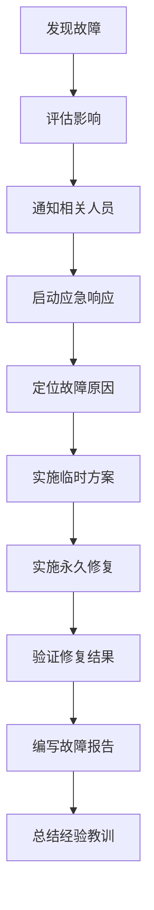

# BaseBackend 微服务故障排查手册

## 📋 概述

本文档提供了 BaseBackend 微服务架构常见故障的排查方法和解决方案，帮助运维人员快速定位和解决问题。

---

## 🔍 故障排查流程

### 标准排查步骤


### 故障分级

| 级别 | 描述 | 响应时间 | 处理要求 |
|------|------|----------|----------|
| P0 | 系统完全不可用 | 15分钟 | 立即响应，全员参与 |
| P1 | 核心功能不可用 | 30分钟 | 立即响应，相关人员参与 |
| P2 | 部分功能异常 | 2小时 | 及时响应，相关人员处理 |
| P3 | 非核心功能异常 | 4小时 | 及时响应，相关人员处理 |

---

## 🚨 常见故障及解决方案

### 1. 服务启动失败

#### 症状
- 服务无法启动或启动后立即停止
- 端口被占用错误
- 数据库连接失败
- 配置错误

#### 排查步骤

**步骤1: 检查端口占用**

```bash
# 检查端口是否被占用
lsof -i :8081

# 检查所有服务的端口占用情况
netstat -tlnp | grep -E ":(8080|8081|8082|8083)"

# 查看进程详情
ps aux | grep java
```

**步骤2: 查看启动日志**

```bash
# 查看用户服务启动日志
tail -100 /opt/basebackend/logs/user-service.log

# 搜索错误信息
grep -i "error\|exception\|fail" /opt/basebackend/logs/user-service.log

# 实时查看日志
tail -f /opt/basebackend/logs/user-service.log
```

**步骤3: 检查依赖服务**

```bash
# 检查 MySQL 连接
mysql -u basebackend -p -h localhost -e "SELECT 1;" basebackend

# 检查 Redis 连接
redis-cli ping

# 检查 Nacos 连接
curl http://localhost:8848/nacos/v1/console/health/readiness
```

#### 解决方案

**方案1: 释放被占用的端口**

```bash
# 找到占用端口的进程
lsof -ti:8081

# 终止进程
lsof -ti:8081 | xargs kill -9

# 重新启动服务
cd /opt/basebackend/basebackend-user-service
nohup mvn spring-boot:run > ../../logs/user-service.log 2>&1 &
```

**方案2: 修复数据库连接**

```bash
# 检查数据库配置
grep -A 10 "spring.datasource" /opt/basebackend/basebackend-user-service/src/main/resources/application.yml

# 测试数据库连接
mysql -u basebackend -p -h localhost basebackend

# 重启 MySQL 服务
sudo systemctl restart mysql
```

**方案3: 修复 Redis 连接**

```bash
# 检查 Redis 配置
grep -A 10 "spring.redis" /opt/basebackend/basebackend-user-service/src/main/resources/application.yml

# 测试 Redis 连接
redis-cli -h localhost -p 6379 ping

# 重启 Redis 服务
sudo systemctl restart redis
```

**方案4: 修复 Nacos 连接**

```bash
# 检查 Nacos 配置
grep -A 10 "spring.cloud.nacos" /opt/basebackend/basebackend-user-service/src/main/resources/application.yml

# 检查 Nacos 服务状态
curl http://localhost:8848/nacos/v1/console/health/readiness

# 重启 Nacos 服务
cd /opt/nacos/bin
./shutdown.sh
./startup.sh -m standalone
```

---

### 2. API 调用失败

#### 症状
- 返回 4xx 或 5xx 错误码
- 请求超时
- 服务间调用失败

#### 排查步骤

**步骤1: 检查服务状态**

```bash
# 检查所有服务健康状态
curl http://localhost:8081/actuator/health
curl http://localhost:8082/actuator/health
curl http://localhost:8083/actuator/health

# 批量检查服务状态
for port in 8080 8081 8082 8083 8084 8085 8088 8089 8090 8091; do
    echo "检查端口 $port:"
    curl -s http://localhost:$port/actuator/health || echo "服务不可用"
done
```

**步骤2: 检查网关路由**

```bash
# 检查网关日志
tail -100 /opt/basebackend/logs/gateway.log

# 测试网关路由
curl -v http://localhost:8080/api/users

# 检查路由配置
cat /opt/basebackend/basebackend-gateway/src/main/resources/config/*.yml
```

**步骤3: 检查网络连通性**

```bash
# 测试服务间连通性
curl -v http://localhost:8081/api/users

# 检查防火墙
sudo iptables -L

# 检查服务监听端口
netstat -tlnp | grep java
```

#### 解决方案

**方案1: 修复认证问题**

```bash
# 获取认证 Token
curl -X POST http://localhost:8080/api/auth/login \
    -H "Content-Type: application/json" \
    -d '{"username":"admin","password":"admin123"}'

# 使用 Token 调用 API
TOKEN="eyJhbGciOiJIUzI1NiJ9..."
curl -H "Authorization: Bearer $TOKEN" \
    http://localhost:8081/api/users
```

**方案2: 修复网关路由**

```yaml
# 检查并修复 application.yml
spring:
  cloud:
    gateway:
      routes:
        - id: user-service
          uri: lb://basebackend-user-service
          predicates:
            - Path=/api/users/**
          filters:
            - StripPrefix=1
```

**方案3: 检查服务注册**

```bash
# 查看 Nacos 服务列表
curl "http://localhost:8848/nacos/v1/ns/instance/list?serviceName=basebackend-user-service&groupName=DEFAULT_GROUP"

# 手动注册服务
curl -X POST "http://localhost:8848/nacos/v1/ns/instance?serviceName=basebackend-user-service&groupName=DEFAULT_GROUP&ip=127.0.0.1&port=8081"
```

---

### 3. 数据库连接异常

#### 症状
- 数据库连接超时
- 连接池耗尽
- SQL 语法错误

#### 排查步骤

**步骤1: 检查数据库服务**

```bash
# 检查 MySQL 进程
ps aux | grep mysqld

# 检查 MySQL 端口
netstat -tlnp | grep 3306

# 尝试连接数据库
mysql -u basebackend -p -h localhost basebackend
```

**步骤2: 检查连接池配置**

```yaml
# application.yml
spring:
  datasource:
    druid:
      initial-size: 5
      min-idle: 5
      max-active: 20
      max-wait: 60000
```

**步骤3: 查看慢查询**

```sql
-- 查看慢查询日志
SELECT * FROM mysql.slow_log ORDER BY start_time DESC LIMIT 10;

-- 查看当前连接
SHOW PROCESSLIST;

-- 查看连接数状态
SHOW STATUS LIKE 'Threads_connected';
SHOW STATUS LIKE 'Max_used_connections';
```

#### 解决方案

**方案1: 调整连接池参数**

```yaml
spring:
  datasource:
    druid:
      initial-size: 10
      min-idle: 10
      max-active: 50
      max-wait: 30000
      time-between-eviction-runs-millis: 60000
      min-evictable-idle-time-millis: 300000
      validation-query: SELECT 1
      test-while-idle: true
      test-on-borrow: false
      test-on-return: false
```

**方案2: 优化 SQL 查询**

```sql
-- 查看查询执行计划
EXPLAIN SELECT * FROM sys_user WHERE username = 'admin';

-- 添加索引
ALTER TABLE sys_user ADD INDEX idx_username (username);

-- 分析表统计信息
ANALYZE TABLE sys_user;
```

**方案3: 重启 MySQL 服务**

```bash
# 重启 MySQL
sudo systemctl restart mysql

# 查看错误日志
sudo tail -100 /var/log/mysql/error.log

# 检查 MySQL 配置
cat /etc/mysql/mysql.conf.d/mysqld.cnf
```

---

### 4. Redis 连接异常

#### 症状
- Redis 连接超时
- 缓存穿透
- 内存不足

#### 排查步骤

**步骤1: 检查 Redis 服务**

```bash
# 检查 Redis 进程
ps aux | grep redis

# 检查 Redis 端口
netstat -tlnp | grep 6379

# 测试 Redis 连接
redis-cli ping
```

**步骤2: 查看 Redis 日志**

```bash
# 查看 Redis 日志
tail -100 /var/log/redis/redis-server.log

# 查看错误日志
grep "error\|ERR" /var/log/redis/redis-server.log
```

**步骤3: 检查内存使用**

```bash
# 查看 Redis 内存使用
redis-cli info memory

# 查看内存使用详情
redis-cli info stats | grep used_memory

# 查看内存碎片
redis-cli info memory | grep mem_fragmentation_ratio
```

#### 解决方案

**方案1: 调整 Redis 配置**

```conf
# /etc/redis/redis.conf
maxmemory 2gb
maxmemory-policy allkeys-lru
save 900 1
save 300 10
save 60 10000
```

**方案2: 清理过期缓存**

```bash
# 查看所有键
redis-cli --scan --pattern "*"

# 删除所有键 (谨慎使用)
redis-cli FLUSHALL

# 删除指定模式的键
redis-cli --scan --pattern "user:*" | xargs redis-cli DEL
```

**方案3: 重启 Redis 服务**

```bash
# 重启 Redis
sudo systemctl restart redis

# 查看服务状态
sudo systemctl status redis
```

---

### 5. 内存泄漏

#### 症状
- 内存使用率持续增长
- 系统响应变慢
- 触发 OOM 错误

#### 排查步骤

**步骤1: 监控内存使用**

```bash
# 查看系统内存使用
free -h
top -p $(pgrep -f java)

# 查看 Java 进程内存
jstat -gc <pid>
jstat -gcutil <pid>
```

**步骤2: 生成堆转储**

```bash
# 生成堆转储文件
jmap -dump:format=b,file=/opt/basebackend/dumps/heap.bin <pid>

# 查看堆转储文件
jhat /opt/basebackend/dumps/heap.bin

# 使用 MAT 工具分析
# 下载 Eclipse Memory Analyzer Tool
# https://www.eclipse.org/mat/
```

**步骤3: 分析 GC 日志**

```bash
# 查看 GC 日志
tail -f /opt/basebackend/logs/gc.log

# 分析 GC 原因
grep "Full GC" /opt/basebackend/logs/gc.log

# 查看 GC 频率
grep "GC (Allocation Failure)" /opt/basebackend/logs/gc.log
```

#### 解决方案

**方案1: 调整 JVM 参数**

```bash
nohup mvn spring-boot:run \
    -Dspring-boot.run.jvmArguments="
        -Xms2g -Xmx2g
        -XX:+UseG1GC
        -XX:MaxGCPauseMillis=200
        -XX:+PrintGCDetails
        -XX:+PrintGCTimeStamps
        -Xloggc:/opt/basebackend/logs/gc.log
        -XX:+HeapDumpOnOutOfMemoryError
        -XX:HeapDumpPath=/opt/basebackend/dumps/
    " \
    > /opt/basebackend/logs/user-service.log 2>&1 &
```

**方案2: 代码优化**

- 避免创建过多的对象
- 及时释放不再使用的资源
- 使用对象池
- 优化缓存策略

**方案3: 重启服务**

```bash
# 停止服务
pkill -9 -f user-service

# 启动服务
cd /opt/basebackend/basebackend-user-service
nohup mvn spring-boot:run > ../../logs/user-service.log 2>&1 &
```

---

### 6. CPU 使用率过高

#### 症状
- CPU 使用率持续 100%
- 系统响应缓慢
- 服务超时

#### 排查步骤

**步骤1: 监控 CPU 使用**

```bash
# 查看 CPU 使用率
top

# 查看 Java 进程 CPU 使用
top -p $(pgrep -f java)

# 查看系统负载
uptime
```

**步骤2: 查找 CPU 热点**

```bash
# 查看线程 CPU 使用
jstack <pid> > thread-dump.txt

# 使用工具分析
# 安装 async-profiler
# profiler.sh -d 60 -f profile.html <pid>
```

**步骤3: 分析线程堆栈**

```bash
# 生成线程转储
jstack <pid> > thread-dump.txt

# 查找 CPU 占用高的线程
grep "nid=" thread-dump.txt | sort -u

# 分析线程状态
grep "java.lang.Thread.State" thread-dump.txt
```

#### 解决方案

**方案1: 优化代码**

- 减少循环嵌套
- 避免死循环
- 使用异步处理
- 优化算法

**方案2: 调整 JVM 参数**

```bash
-XX:+UseStringDeduplication    # 字符串去重
-XX:+UseCompressedOops         # 压缩对象指针
-XX:+UseCompressedClassPointers # 压缩类指针
```

**方案3: 重启服务**

```bash
# 重启服务释放资源
pkill -9 -f user-service
cd /opt/basebackend/basebackend-user-service
nohup mvn spring-boot:run > ../../logs/user-service.log 2>&1 &
```

---

### 7. 磁盘空间不足

#### 症状
- 写入失败
- 系统警告磁盘空间不足

#### 排查步骤

**步骤1: 查看磁盘使用**

```bash
# 查看磁盘使用情况
df -h

# 查看目录大小
du -sh /opt/basebackend/logs/*
du -sh /opt/basebackend/backups/*
```

**步骤2: 查找大文件**

```bash
# 查找大于 100M 的文件
find /opt/basebackend -type f -size +100M -exec ls -lh {} \;

# 查找最近 7 天修改的文件
find /opt/basebackend -type f -mtime -7 -exec ls -lh {} \;
```

**步骤3: 清理日志文件**

```bash
# 清理 7 天前的日志文件
find /opt/basebackend/logs -type f -mtime +7 -delete

# 清理 30 天前的备份文件
find /opt/basebackend/backups -type f -mtime +30 -delete
```

#### 解决方案

**方案1: 配置日志轮转**

```bash
# /etc/logrotate.d/basebackend
/opt/basebackend/logs/*.log {
    daily
    rotate 30
    compress
    delaycompress
    missingok
    notifempty
    copytruncate
    dateext
}
```

**方案2: 自动清理脚本**

```bash
#!/bin/bash

# 清理 7 天前的日志
find /opt/basebackend/logs -type f -mtime +7 -delete

# 清理 30 天前的备份
find /opt/basebackend/backups -type f -mtime +30 -delete

# 清理临时文件
rm -rf /tmp/basebackend-*

echo "清理完成"
```

---

### 8. 网络连接异常

#### 症状
- 连接超时
- 连接拒绝
- 带宽不足

#### 排查步骤

**步骤1: 检查网络连通性**

```bash
# Ping 测试
ping -c 4 127.0.0.1

# 检查端口连通性
telnet localhost 8081

# 检查网络接口
ip addr show
```

**步骤2: 检查防火墙**

```bash
# 查看防火墙规则
sudo iptables -L

# 查看端口监听
netstat -tlnp | grep 8081
```

**步骤3: 检查网络配置**

```bash
# 查看网络配置
cat /etc/network/interfaces

# 查看 DNS 配置
cat /etc/resolv.conf

# 测试 DNS 解析
nslookup localhost
```

#### 解决方案

**方案1: 配置防火墙**

```bash
# 开放端口
sudo ufw allow 8080
sudo ufw allow 8081
sudo ufw allow 8082

# 重启防火墙
sudo ufw reload
```

**方案2: 调整网络参数**

```bash
# /etc/sysctl.conf
net.core.somaxconn = 65535
net.ipv4.tcp_max_syn_backlog = 65535
net.core.netdev_max_backlog = 5000
net.ipv4.tcp_keepalive_time = 600
net.ipv4.tcp_keepalive_intvl = 30
net.ipv4.tcp_keepalive_probes = 3

# 应用配置
sudo sysctl -p
```

---

## 🔧 故障排查工具

### 1. JVM 工具

#### jstat (JVM 统计信息)

```bash
# 查看 GC 统计
jstat -gc <pid> 5s

# 查看类加载统计
jstat -class <pid>

# 查看编译统计
jstat -compiler <pid>
```

#### jmap (内存映射)

```bash
# 查看对象直方图
jmap -histo <pid>

# 生成堆转储
jmap -dump:format=b,file=heap.bin <pid>

# 查看详细信息
jmap -heap <pid>
```

#### jstack (线程堆栈)

```bash
# 生成线程转储
jstack <pid>

# 生成线程转储并保存到文件
jstack <pid> > thread-dump.txt
```

### 2. 数据库工具

#### MySQL 工具

```bash
# 查看进程列表
mysql -u root -p -e "SHOW PROCESSLIST;"

# 查看锁信息
mysql -u root -p -e "SHOW ENGINE INNODB STATUS\G"

# 查看慢查询
mysql -u root -p -e "SELECT * FROM mysql.slow_log ORDER BY start_time DESC LIMIT 10;"
```

### 3. 网络工具

#### curl

```bash
# 测试 API 接口
curl -v http://localhost:8081/api/users

# 测试健康检查
curl http://localhost:8081/actuator/health

# 测试 Prometheus 指标
curl http://localhost:8081/actuator/prometheus
```

#### netstat

```bash
# 查看端口监听
netstat -tlnp | grep 8081

# 查看网络连接
netstat -an | grep 8081

# 查看连接状态
ss -ant | grep 8081
```

---

## 📊 性能基准

### 服务性能指标

| 指标 | 目标值 | 警告值 | 严重值 |
|------|--------|--------|--------|
| 响应时间 (P95) | < 200ms | 200-500ms | > 500ms |
| 响应时间 (P99) | < 500ms | 500-1000ms | > 1000ms |
| QPS | > 1000 | 500-1000 | < 500 |
| 错误率 | < 0.1% | 0.1-1% | > 1% |
| CPU 使用率 | < 80% | 80-90% | > 90% |
| 内存使用率 | < 80% | 80-90% | > 90% |

### 监控阈值

```bash
#!/bin/bash

# 设置告警阈值
CPU_THRESHOLD=80
MEMORY_THRESHOLD=80
DISK_THRESHOLD=80
RESPONSE_TIME_THRESHOLD=500
ERROR_RATE_THRESHOLD=1

# 检查 CPU 使用率
CPU_USAGE=$(top -bn1 | grep "Cpu(s)" | awk '{print $2}' | cut -d'%' -f1)
if (( $(echo "$CPU_USAGE > $CPU_THRESHOLD" | bc -l) )); then
    echo "⚠️  CPU 使用率过高: ${CPU_USAGE}%"
fi

# 检查内存使用率
MEMORY_USAGE=$(free | grep Mem | awk '{printf "%.2f", $3/$2 * 100.0}')
if (( $(echo "$MEMORY_USAGE > $MEMORY_THRESHOLD" | bc -l) )); then
    echo "⚠️  内存使用率过高: ${MEMORY_USAGE}%"
fi

# 检查磁盘使用率
DISK_USAGE=$(df -h / | awk 'NR==2{print $5}' | cut -d'%' -f1)
if [ "$DISK_USAGE" -gt "$DISK_THRESHOLD" ]; then
    echo "⚠️  磁盘使用率过高: ${DISK_USAGE}%"
fi
```

---

## 📚 故障案例分析

### 案例1: 用户服务内存泄漏

**问题描述**:
- 内存使用率持续增长
- 系统响应变慢
- 触发 OOM 错误

**分析过程**:
1. 使用 jmap 生成堆转储文件
2. 使用 MAT 工具分析堆转储
3. 发现大量未释放的数据库连接对象

**解决方案**:
1. 在 finally 块中关闭数据库连接
2. 调整连接池参数
3. 重启服务释放内存

**预防措施**:
1. 代码审查时重点检查资源释放
2. 定期进行内存分析
3. 启用内存监控告警

### 案例2: 数据库连接池耗尽

**问题描述**:
- 应用响应缓慢
- 部分请求失败
- 日志显示连接池耗尽

**分析过程**:
1. 查看数据库连接数达到最大值
2. 检查慢查询发现长时间执行的 SQL
3. 发现缺少索引导致全表扫描

**解决方案**:
1. 为查询字段添加索引
2. 调整连接池参数
3. 优化 SQL 查询

**预防措施**:
1. 建立数据库索引审查流程
2. 定期分析慢查询
3. 监控连接池使用情况

---

## 📞 应急响应流程

### 故障响应流程



### 应急联系信息

| 角色 | 姓名 | 电话 | 邮箱 |
|------|------|------|------|
| 值班工程师 | 张三 | 13800138000 | oncall@example.com |
| 技术负责人 | 李四 | 13800138001 | lead@example.com |
| 系统管理员 | 王五 | 13800138002 | admin@example.com |

---

**编制**: 浮浮酱 🐱（猫娘工程师）
**日期**: 2025-11-15
**版本**: v1.0.0
